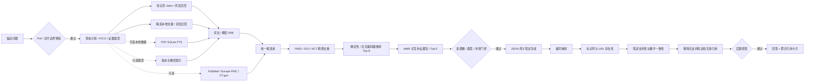

# 架构与实现说明

## 请求链路

## 离线与在线边界

精选本地支路执行 BM25 与 TF-IDF 余弦召回，再用 RRF 融合；可选 PDF 支路使用磁盘型 SQLite FTS 先召回最多 100 个 chunk，再做同一套 BM25/余弦/RRF 精排，并限制每篇论文最多占两个候选位。启用阶段 2 后，原问题、中英文 API 查询和本地扩展词分别编码，在版本化稠密索引中独立召回，再与词法 Top-30 用 RRF 合并为 Top-40。API 支路只做数据源支持的关键词/字段检索。所有结果转为 `Entry` 后才进入统一重排，避免直接比较不同来源的原始分数。

稠密索引由 `scripts/build_dense_index.py` 离线构建，路径同时绑定 `corpus_version`、模型标识和模型修订。记录、向量矩阵与校验和不一致时拒绝加载；同一版本禁止原地覆盖。模型和索引不会在 Streamlit 请求中下载或构建。

PDF 索引以本地 `selected_manifest.csv` 的 PMID 为主键，并在建库时批量固化 PubMed 的题名、摘要、期刊、年份、作者与 PublicationType。有效 PDF 由 PyMuPDF 提取带坐标的文本块，双栏页面按跨栏块、左栏、右栏重排后，再按页切成 1,800 字符左右的 chunk；无效或无法提取正文的文件使用 PubMed 摘要兜底。论文原文、批量元数据和生成索引均为可选本地数据，不随开源仓库分发。

混合模式先重排本地知识页和快照。Top-1 达到 `PRE_REFUSAL_THRESHOLD` 时通常跳过 API；若问题明确要求“最新/最近/当前”证据，即使本地结果达标也会强制刷新实时源。任何一个源异常都只影响该源，不中断其余链路。

检索结果先按 PMID/DOI/NCT 建立跨提供方的规范来源 ID；存在试验注册号时，再用 NCT 建立研究家族 ID，避免同一试验的多篇出版物被误算成多个独立来源。同一研究家族最多保留两个 chunk。统一重排可选择确定性评分器或交叉编码器，保留 Top-8 供审计，再按 `overview / causal / boundary` 三种证据角色和文本冗余度挑选最多 5 条交给生成器。引用编号始终对应完整 Top-8 evidence map。

任何检索和外部调用之前都会运行安全预检。疑似姓名、病历号、证件号、联系方式、完整出生日期，以及个体化剂量、停药、换药请求会被阻断；外部检索只接收去标识化后的查询计划。

## 引用校验语义

1. 编号映射：`paragraphs[].citation_ids` 必须在本次 Top-8 evidence map 中。
2. 存在性：知识页检查已核对 PMID；其他来源要求规范标识或 URL 可回查。
3. 支持性：抽取生成必须逐字对应条目；在线生成使用独立词项规则，接口可替换为 NLI/LLM judge。
4. 数字一致性：陈述中的数字、年份和百分比必须出现在证据正文或结构化元数据中。
5. 输出净化：每条原子陈述至少保留一个完整通过的引用；失败陈述和失败引用在进入 UI 前删除。

净化后没有核心陈述、失败比例仍不可接受或模型主动 `refused=true` 时，输出结构化拒答。拒答包含稳定原因码，以及“已找到什么、缺什么、下一步查什么”。

## 可插拔后端状态

| 默认后端 | 可选后端 | 状态与不受影响的模块 |
|---|---|---|
| BM25 + TF-IDF | 本地 sentence-transformers 兼容嵌入模型 + 版本化矩阵索引 | 已接入；schemas、校验、UI 不变 |
| 确定性重排 | sentence-transformers 兼容 CrossEncoder | 已接入；生成、拒答、评估不变 |
| 规则查询扩展 | JSON-mode LLM PICO 改写 | 检索器与后续链路 |
| 词项支持性 | 独立 NLI/LLM judge | 编号与存在性校验 |
| JSON 文件知识页 | 审阅工作流 + 版本数据库 | 检索接口与 UI |

## 阈值校准

`PRE_REFUSAL_THRESHOLD` 当前默认 0.18，是针对 legacy 语料和确定性评分器的保守初值。替换为交叉编码器后分数分布会改变，必须在冻结开发集上分病种重新校准，不能照搬绝对值。当前 15 题只用于回归；达到发布门禁仍依赖下一阶段文档定义的 48 题和文档级 qrels。
