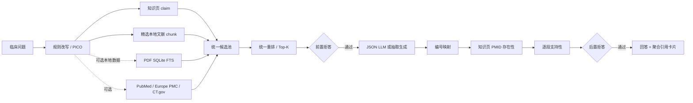

# 架构与实现说明

## 请求链路

## 离线与在线边界

精选本地支路执行 BM25 与 TF-IDF 余弦召回，再用 RRF 融合；可选 PDF 支路使用磁盘型 SQLite FTS 先召回最多 100 个 chunk，再做同一套 BM25/余弦/RRF 精排，并限制每篇论文最多占两个候选位。API 支路只做数据源支持的关键词/字段检索。所有结果转为 `Entry` 后才由同一个评分器重排，避免把不同来源原始分数直接比较。

PDF 索引以本地 `selected_manifest.csv` 的 PMID 为主键，并在建库时批量固化 PubMed 的题名、摘要、期刊、年份、作者与 PublicationType。有效 PDF 由 PyMuPDF 提取带坐标的文本块，双栏页面按跨栏块、左栏、右栏重排后，再按页切成 1,800 字符左右的 chunk；无效或无法提取正文的文件使用 PubMed 摘要兜底。论文原文、批量元数据和生成索引均为可选本地数据，不随开源仓库分发。

混合模式先重排本地知识页和快照。Top-1 达到 `PRE_REFUSAL_THRESHOLD` 时跳过 API；否则在开启实时检索时调用三个源。任何一个源异常都只影响该源，不中断其余链路。

## 引用校验语义

1. 编号映射：`paragraphs[].citation_ids` 必须在 Top-K 中。
2. 存在性：仅知识页 `type=pmid` 检查核对状态；API 命中条目本身来自检索，不重复回查。
3. 支持性：抽取生成必须逐字对应条目；在线生成使用独立的词项支持性规则。生产环境可把 `_support` 替换为独立 LLM/NLI 模型。

失败比例超过阈值、全部段落失去支持或模型主动 `refused=true` 时，不展示未经支持的结论。

## 推荐的生产替换

| 当前 MVP | 生产替换 | 不受影响的模块 |
|---|---|---|
| TF-IDF 余弦 | bge-m3 / 在线 embedding + Chroma | schemas、候选池、校验、UI |
| 确定性重排 | bge-reranker-v2-m3 | 生成、拒答、评估 |
| 规则查询扩展 | JSON-mode LLM PICO 改写 | 检索器与后续链路 |
| 词项支持性 | 独立 NLI/LLM judge | 编号与存在性校验 |
| JSON 文件知识页 | 审阅工作流 + 版本数据库 | 检索接口与 UI |

## 阈值校准

`PRE_REFUSAL_THRESHOLD` 当前默认 0.18，是针对内置 dev/test 语料的保守初值。替换重排器后分数分布会改变，必须重新使用 5–10 题 dev 集分病种校准，不能照搬绝对值。
