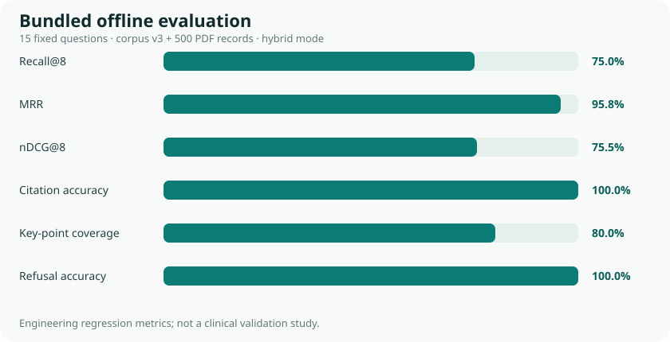

# 离线工程评估报告



本报告对应语料版本 `v3`、混合模式、关闭实时 API 的固定回归测试。评估环境接入了基于 PyMuPDF 多栏重排的 500 条 PMID PDF 本地数据源（18,002 个全文/摘要 chunk）；该本地语料和生成索引不随仓库分发。测试集包含 15 题，其中 12 题应回答、3 题应拒答。

| 指标 | 结果 |
|---|---:|
| Recall@8 | 100.0% |
| MRR | 95.8% |
| nDCG@8 | 96.0% |
| 引用准确率 | 100.0% |
| 关键点覆盖率 | 89.6% |
| 拒答正确率 | 100.0% |
| 平均端到端延迟 | 53.7 ms |

这些数字是针对内置小型语料与固定问题集的工程回归指标，证明检索映射、引用校验和拒答链路按预期工作；它们不构成临床有效性验证，也不能外推到真实世界的全部问题。

复现命令：

```bash
python3 eval/run_eval.py --mode hybrid
```

脚本同时输出 JSON、CSV 与 SVG，便于课程报告引用。纯 LLM 对照需要配置 `LLM_API_KEY`，入口位于 `eval/baseline.py`。
