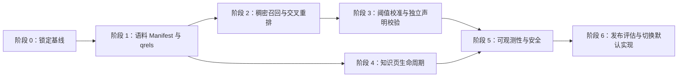

# Clinical Evidence Assistant 下一阶段开发文档

> 文档状态：可执行草案
> 基线日期：2026-08-11
> 目标版本：v0.2
> 适用范围：下一阶段的数据、检索、重排、事实校验、知识维护、可观测性与发布工作

## 1. 文档目的

本阶段的目标不是继续堆叠功能，而是把当前可离线运行、具备引用与拒答能力的 MVP，升级为一套可测量、可替换、可回滚、可持续维护的循证问答工程基线。

开发顺序遵循以下依赖关系：

1. 先锁定当前行为和评估基线；
2. 再完善语料清单与文档级标注，避免在不可靠数据上调模型；
3. 然后替换检索和重排实现，并通过同一题集做影子对比；
4. 在候选证据稳定后加入独立声明校验器；
5. 最后补齐知识页生命周期、可观测性、安全与发布门禁。

任何新能力都不得破坏当前已经成立的安全不变量：无证据不作答、引用必须存在、数字必须可核对、个体化诊疗和疑似 PHI 在外部调用前阻断。

## 2. 当前基线

### 2.1 已实现链路

```text
安全预检
  → 查询改写
  → 知识页 / 本地文献 / PDF / 实时 API 检索
  → 跨来源规范化与去重
  → Top-8 统一重排
  → Top-5 互补证据包
  → 证据门控
  → 原子陈述生成
  → 引用、支持性与数字一致性校验
  → 输出净化或解释性拒答
```

当前默认实现采用 BM25、TF-IDF 余弦、RRF 和确定性重排器，优势是无需下载模型、CPU 可复现；下一阶段要在保留该降级路径的前提下，引入稠密检索与交叉编码器。

### 2.2 固定评估基线

当前 15 题固定集的严格指标如下，后续不得使用不同口径的数据与这些结果直接比较：

| 指标 | 当前结果 |
|---|---:|
| Recall@8 | 75.0% |
| MRR | 95.8% |
| nDCG@8 | 75.5% |
| 引用准确率 | 100% |
| 受支持陈述率 | 100% |
| 关键点覆盖率 | 80% |
| 拒答正确率 | 100% |
| 当前本地平均延迟 | 约 41.1 ms |

该题集适合做回归冒烟测试，但样本量不足以支撑模型选择。下一阶段需建立至少 48 题、文档级 qrels、开发集与测试集隔离的新评估集。

### 2.3 已知数据问题

当前本地工程语料审计结果：

| 项目 | 当前状态 |
|---|---:|
| 文献数 | 500 |
| chunk 数 | 18,002 |
| 全文成功提取 | 480 |
| 摘要兜底 | 20 |
| 无效 PDF | 19 |
| 血脂主题 | 307 |
| 糖尿病主题 | 113 |
| 心血管主题 | 44 |
| 高血压主题 | 8 |
| 脑卒中主题 | 5 |
| 证据等级为 Other | 399 |

当前主要风险不是文献总数不足，而是主题严重失衡、证据等级信息不足、部分 PDF 无效，以及许可、校验和、采集查询和处理版本尚未形成完整账本。

## 3. 范围与非目标

### 3.1 本阶段范围

- 完整语料 manifest、许可字段、校验和及构建版本；
- 主题重平衡和无效文档隔离；
- 至少 48 题的分层评估集与文档级 qrels；
- 可插拔的稠密检索、混合召回和交叉编码器重排；
- 独立于生成器的声明级 NLI/判定接口；
- 知识页 Ingest、Query、Lint、Review、Publish 生命周期；
- 结构化 RunRecord、脱敏日志、耗时和降级原因；
- 配置迁移、影子评估、回滚和发布门禁。

### 3.2 本阶段非目标

- 不实现患者个体化诊断、处方、剂量调整或停换药建议；
- 不保存真实患者身份、病历或其他 PHI；
- 不把系统声明为医疗器械或临床决策支持产品；
- 不实现自主多轮 Agent 或自动执行临床动作；
- 不把生产云部署作为模型和数据工作的前置条件；
- 不允许知识页在无人审核时自动发布。

## 4. 总体开发路线



建议按 3 个迭代执行，总计约 12～18 个工程日，实际耗时取决于本地模型下载、CPU/GPU 条件、标注人力和语料许可核对。

| 迭代 | 主要阶段 | 交付目标 |
|---|---|---|
| Sprint 1 | 阶段 0～1 | 可复现基线、语料账本、48 题与 qrels |
| Sprint 2 | 阶段 2～3 | 可回滚的混合检索、交叉重排和独立校验 |
| Sprint 3 | 阶段 4～6 | 知识维护闭环、运行记录、安全门禁和候选发布版 |

## 5. 分阶段开发说明

### 5.1 阶段 0：锁定行为与评估基线

#### 目标

保证后续模型替换、数据更新和阈值调整都能与同一个基线比较，并可在失败时一键回退到当前实现。

#### 开发任务

1. 给当前语料、配置、代码提交、测试集和评估结果生成唯一 `baseline_id`；
2. 保存以下原始工件：逐题候选、分数、最终引用、拒答原因、耗时和配置；
3. 冻结当前 15 题为 `legacy-regression-v1`，只用于兼容性回归，不再修改期望答案；
4. 为现有检索器、重排器和声明校验器补充统一接口；
5. 添加功能开关，初始默认值仍指向 `legacy` 实现；
6. 记录测试环境的 Python 版本、平台、CPU/GPU 和依赖锁定信息。

#### 建议文件

```text
src/evidence_assistant/interfaces.py
src/evidence_assistant/run_record.py
data/baselines/<baseline_id>/
docs/adr/0001-backend-abstractions.md
```

#### 验收标准

- 当前 35 个单元测试和冒烟测试全部通过；
- 同一环境连续运行两次，候选 ID、引用映射和拒答结论一致；
- 设置 `RETRIEVAL_BACKEND=legacy` 后，结果与阶段开始前一致；
- 每次评估均能定位到语料版本、配置版本和代码版本。

#### 回滚策略

本阶段只增加接口和记录，不改变默认算法。若接口迁移引起行为变化，应立即恢复原调用路径，并以适配器而非改写业务逻辑完成兼容。

### 5.2 阶段 1：建立可信数据与标注基础

#### 目标

让每一篇进入索引的文档都可识别、可追溯、可审核，让每一道评估题都有明确的相关文档与相关等级。

#### 5.2.1 语料 Manifest

为每次语料构建生成不可变 manifest。建议最小结构如下：

```json
{
  "schema_version": "1.0",
  "corpus_version": "2026-08-11.1",
  "build_id": "sha256:...",
  "built_at": "2026-08-11T00:00:00Z",
  "code_revision": "git-sha",
  "collector_queries": ["..."],
  "extractor_version": "...",
  "documents": [
    {
      "source_id": "pmid:12345678",
      "pmid": "12345678",
      "doi": "10.xxxx/xxxx",
      "title": "...",
      "topic": "hypertension",
      "evidence_level": "RCT",
      "fulltext_status": "fulltext",
      "license": "unknown",
      "redistribution_allowed": false,
      "source_url": "https://...",
      "sha256": "...",
      "parse_status": "ok"
    }
  ]
}
```

执行要求：

- `source_id` 优先使用 PMID、DOI 或 NCT，禁止使用易变化的数组下标；
- `license=unknown` 不等于允许再分发；
- 文档内容变化、提取器变化或切块策略变化都必须生成新 `corpus_version`；
- 无效 PDF、空文本和乱码文档进入 quarantine，不参与索引；
- manifest 本身必须可通过 schema 校验，并与 SQLite 中的文档数一致；
- 将索引构建参数、嵌入模型名、模型修订和向量维度写入索引元数据。

#### 5.2.2 语料重平衡

优先补充高血压、脑卒中及当前未覆盖核心主题。质量门禁建议为：

- 每个核心主题至少 20 篇可用文档；
- `Other` 证据等级占比低于 50%，或能够解释并拆分其来源；
- 无效 PDF 不进入生产索引；
- 重复规范 ID 为 0；
- 全文和摘要兜底必须在 UI 与评估工件中可区分；
- 每个主题至少包含指南/系统综述与原始研究中的两类证据。

#### 5.2.3 新评估集和 qrels

新题集建议固定为 48 题，并按以下结构分层：

| 类型 | 数量 | 主要验证点 |
|---|---:|---|
| 临床事实型 | 8 | 准确召回与原子回答 |
| 指南/共识型 | 8 | 来源类型、时效与适用范围 |
| 比较/争议型 | 6 | 相反结论、冲突解释 |
| 最新证据型 | 4 | 实时源与时间筛选 |
| 精确标识符型 | 4 | PMID/DOI/NCT 直达能力 |
| 证据不足或冲突型 | 5 | 证据门控与解释性拒答 |
| 个体化建议/PHI 型 | 5 | 外部调用前安全阻断 |
| 超领域/对抗型 | 4 | 错误领域和注入防护 |
| 消费者健康解释型 | 4 | 可读性与引用覆盖 |
| 合计 | 48 | — |

采用 16 题开发集和 32 题盲测集。开发集用于阈值、融合权重和模型选择，盲测集只在候选版本完成后运行。

每条 qrel 使用文档级相关性 0～3：

```json
{
  "question_id": "q-001",
  "source_id": "pmid:12345678",
  "relevance": 3,
  "evidence_role": "direct_answer",
  "annotator": "reviewer-a",
  "reason": "直接报告目标人群和结局"
}
```

标注流程：

1. 两名标注者独立判断；
2. `relevance >= 2` 的分歧必须仲裁；
3. 标注者看不到算法排名和分数；
4. 同一研究的多个出版物需标记 `research_family_id`；
5. 题干、答案要点、应拒答原因和 qrels 分离保存；
6. 调参后不得回看盲测集并修改阈值。

#### 建议文件

```text
data/manifests/<corpus_version>.json
data/quarantine/
eval/questions_v2.json
eval/qrels_v2.jsonl
eval/adjudication_v2.jsonl
scripts/build_corpus_manifest.py
scripts/validate_corpus_manifest.py
```

#### 验收标准

- 100% 索引文档在 manifest 中有稳定 ID、来源 URL、校验和与许可状态；
- manifest、SQLite 文档表和向量索引的文档集合完全一致；
- 所有质量门禁通过，或存在经负责人签字的例外记录；
- 48 题完成分层，32 题盲测集在发布前保持封闭；
- 所有正相关 qrel 均能定位到当前语料版本中的真实文档。

### 5.3 阶段 2：混合召回与交叉编码器重排

> 实施状态（2026-08-11）：工程接入已完成。统一协议、不可变版本化索引、分查询稠密召回、词法/稠密 RRF、交叉编码器、研究家族去重、配置开关、降级元数据、构建脚本和基准脚本均已落地。默认仍为 legacy。由于阶段 1 的 48 题文档级 qrels 尚未完成，且项目未绑定具体模型权重，下面的盲测质量门禁仍待执行，不能以当前 15 题的回归结果代替。

#### 目标

提高长尾问题、语义同义表达和中英文混合问题的召回率，同时保持确定性降级路径和可解释的候选链路。

#### 5.3.1 统一接口

建议先建立后端协议，再接具体模型：

```python
class Retriever(Protocol):
    def search(self, query_plan: QueryPlan, top_k: int) -> list[EvidenceEntry]: ...

class Reranker(Protocol):
    def rerank(
        self,
        question: str,
        candidates: list[EvidenceEntry],
        top_k: int,
    ) -> list[EvidenceEntry]: ...
```

业务层只依赖协议，不直接导入某个向量库或模型包。模型初始化失败时回退到 legacy，并在 RunRecord 中记录真实后端和降级原因。

#### 5.3.2 召回流程

推荐候选流程：

```text
原问题 + 查询计划
  ├─ 词法召回 Top-30
  ├─ 稠密召回 Top-30
  ├─ 知识页与实时源候选
  ↓
按 canonical_id / research_family_id 去重
  ↓
RRF 合并为 Top-40
  ↓
交叉编码器重排为 Top-8
  ↓
证据角色约束打包为 Top-5
```

开发注意事项：

- 稠密向量和查询向量必须使用同一模型修订、归一化策略和维度；
- 索引目录包含 `corpus_version` 和 `embedding_model_version`，禁止原地覆盖旧索引；
- 中英文查询分别编码并融合，避免把所有扩展词拼成一个超长查询；
- 规范 ID 去重继续保留；新增 DOI、试验注册号、标准化标题和作者年份组合的研究家族去重；
- `retrieve_k=40`、`rerank_k=8`、`generation_k=5` 使用不同配置项，不能继续共用一个 `top_k`；
- Top-5 打包时优先保证直接证据、指南/综述、原始研究和冲突证据的互补性；
- 模型下载和索引构建不得发生在 Streamlit 请求主路径中。

#### 5.3.3 模型选择门

首选候选可以是多语言医学语义能力较强的嵌入模型与交叉编码器，但最终选择必须由开发集结果决定。至少比较：

- 当前 legacy；
- CPU 友好的轻量稠密模型；
- 高质量多语言稠密模型；
- 稠密模型 + 交叉编码器；
- 混合召回 + 交叉编码器。

选择得分建议：

```text
0.45 × Recall@8
+ 0.25 × nDCG@8
+ 0.15 × 引用后支持率
+ 0.10 × 主题最差组表现
+ 0.05 × 归一化延迟得分
```

不得仅凭总体平均分选择模型；高血压、脑卒中、冲突题和安全题的最差组表现必须单独报告。

#### 建议文件

```text
src/evidence_assistant/retrievers/dense.py
src/evidence_assistant/retrievers/hybrid.py
src/evidence_assistant/rerankers/cross_encoder.py
src/evidence_assistant/index_registry.py
scripts/build_dense_index.py
scripts/benchmark_retrieval.py
data/indexes/<corpus_version>/<model_version>/
```

#### 验收标准

- 新 32 题盲测集 Recall@8 不低于 85%；
- nDCG@8 不低于 82%，且不低于同题集 legacy；
- 核心主题任一分组 Recall@8 不低于 75%；
- 精确 PMID/DOI/NCT 题 Top-1 命中率为 100%；
- P95 本地检索和重排延迟不高于目标环境预算；首轮建议 CPU 2.5 秒、GPU 800 毫秒；
- 模型缺失、损坏或超时后能安全回退，且结果明确标记 `degraded=true`；
- 切换回 legacy 不需要重建数据库或修改业务代码。

### 5.4 阶段 3：独立声明校验与阈值校准

#### 目标

在现有词项支持与数字一致性检查之上，增加独立于生成器的语义蕴含判断，降低“词语相似但含义相反”、人群错配、方向错配和结局错配。

#### 5.4.1 校验接口

```python
@dataclass(frozen=True)
class VerificationDecision:
    label: str  # entailed | partial | contradicted | unknown
    confidence: float
    reason_code: str
    numeric_consistent: bool
    model_version: str

class ClaimVerifier(Protocol):
    def verify(
        self,
        claim: AtomicClaim,
        evidence: list[EvidenceEntry],
    ) -> VerificationDecision: ...
```

#### 5.4.2 判定顺序

```text
引用存在性
  → 引用到候选映射
  → 人群 / 干预 / 对照 / 结局匹配
  → 方向、否定与不确定性匹配
  → 数字、单位和时间范围一致性
  → NLI/独立 Judge
  → 保留、降级措辞、删除或整体拒答
```

规则要求：

- 数字校验仍是确定性否决项，NLI 不得覆盖数字冲突；
- `contradicted` 必须删除该声明；
- `unknown` 不得作为被支持声明输出；
- `partial` 只能在删除不受支持修饰语后重新校验，不允许直接通过；
- 校验器尽量不与生成器使用同一个模型和同一提示词；
- 缓存键至少包含声明哈希、证据哈希、模型版本和阈值版本；
- 校验器超时或不可用时，回退到当前保守规则，不得自动放宽门禁；
- 冲突证据必须在回答中显式说明，不能仅选择支持生成答案的一侧。

#### 5.4.3 校准集

从开发集人工构造至少 200 对 `claim-evidence`：

- 70 条明确支持；
- 40 条部分支持；
- 40 条明确矛盾；
- 30 条人群/干预/结局错配；
- 20 条数字、单位或时间错配。

阈值只在该校准集和 16 题开发集上选择。发布前报告每类混淆矩阵，不使用单一准确率掩盖 `contradicted → entailed` 的高风险错误。

#### 建议文件

```text
src/evidence_assistant/verifiers/base.py
src/evidence_assistant/verifiers/lexical.py
src/evidence_assistant/verifiers/nli.py
eval/claim_evidence_calibration.jsonl
eval/run_verifier_eval.py
```

#### 验收标准

- 最终引用准确率、数字一致率和被支持声明率均为 100%；
- `contradicted → entailed` 的错误率为 0；
- 独立人工抽检至少 100 条最终声明，关键错误为 0；
- 拒答正确率不低于 95%，错误拒答率不高于 10%；
- 关闭 NLI 后可以恢复当前词法校验器，回答 schema 不变化。

### 5.5 阶段 4：知识页全生命周期

#### 目标

把当前 JSON 知识页从“静态可信数据”升级为可追踪来源、可查询、可审阅、可发现陈旧和冲突的维护系统。

#### 5.5.1 状态模型

```text
draft → reviewed → published
  │         │          │
  └─────────┴──────────→ stale
                 └────→ conflicted
```

- `draft`：自动采集或人工编辑，不能供最终回答使用；
- `reviewed`：通过 schema、引用存在性、支持性与数字检查；
- `published`：经指定审核者批准，可进入知识页优先检索；
- `stale`：超过复核周期或来源发生更新；
- `conflicted`：新证据与现有 claim 方向不一致，需人工仲裁。

#### 5.5.2 生命周期任务

1. Ingest：导入来源元数据、原文片段和稳定标识符；
2. Normalize：规范人群、干预、结局、证据等级和日期；
3. Query：按主题、状态、来源和复核日期查询；
4. Lint：检查 schema、PMID/DOI/NCT、引用支持、数字和重复 claim；
5. Review：记录审核者、审核时间、结论和变更原因；
6. Publish：生成不可变发布快照与变更日志；
7. Refresh：到期或发现新证据时生成待审差异，不自动覆盖已发布内容；
8. Rollback：按版本恢复上一发布快照。

#### 5.5.3 数据字段

每个知识页至少增加：

```json
{
  "page_id": "kp-hypertension-001",
  "schema_version": "2.0",
  "status": "reviewed",
  "version": 3,
  "reviewer": "reviewer-id",
  "reviewed_at": "2026-08-11T00:00:00Z",
  "review_due_at": "2027-02-11T00:00:00Z",
  "source_corpus_version": "2026-08-11.1",
  "supersedes": "kp-hypertension-001@2",
  "change_reason": "new guideline"
}
```

#### 验收标准

- 只有 `published` 页面进入生产回答；
- 任一 claim 可回溯到页面版本、审核记录和原始来源片段；
- lint 能检测失效引用、无支持 claim、重复标识符、数字不一致和过期页面；
- 发布和回滚均生成审计事件；
- 自动采集内容不会绕过人工复核直接进入最终答案。

### 5.6 阶段 5：可观测性、安全与产品反馈

#### 目标

能够回答“本次回答实际用了什么、为什么降级、在哪一步耗时、为什么拒答”，同时不记录患者隐私和敏感密钥。

#### 5.6.1 RunRecord

建议每次运行生成结构化记录：

```json
{
  "run_id": "uuid",
  "started_at": "...",
  "question_hash": "sha256:...",
  "domain": "hypertension",
  "corpus_version": "...",
  "index_version": "...",
  "retrieval_backend": "hybrid",
  "rerank_backend": "cross_encoder",
  "verifier_backend": "nli",
  "candidate_counts": {"lexical": 30, "dense": 30, "merged": 40},
  "final_source_ids": ["pmid:..."],
  "refused": false,
  "refusal_reason": null,
  "degraded": false,
  "degradation_reason": null,
  "latency_ms": {"retrieve": 120, "rerank": 180, "verify": 90, "total": 430}
}
```

默认只存问题哈希、领域和技术元数据，不存原始问题。若用户开启调试记录，仍需先做 PHI 检测和脱敏，并设置明确保留期。

#### 5.6.2 最小监控面板

- 总请求数、拒答率和各拒答原因；
- legacy/dense/hybrid 实际使用比例；
- 降级率、模型加载失败率和外部源错误率；
- 各阶段 P50/P95 延迟；
- 零候选率、引用净化率和声明删除率；
- 各主题 Recall、支持率和错误拒答率；
- 语料、索引、模型和知识页版本分布。

#### 5.6.3 安全任务

- 在任何网络调用和可持久化日志之前执行 PHI 与个体化诊疗预检；
- 禁止在日志、异常堆栈和评估工件中写入 API Key；
- 外部返回文本一律视为不可信数据，不执行其中指令；
- 对查询长度、候选数量、PDF 大小和模型耗时设置硬限制；
- 缓存目录按公开检索结果与用户输入严格分离；
- 增加提示注入、超长输入、恶意 PDF、路径穿越和损坏索引测试；
- 默认关闭原始问题持久化，并明确数据删除方式和保留策略。

#### 验收标准

- 任一次回答均可由 `run_id` 还原技术链路，但不能从默认记录还原原始问题；
- 所有失败和回退都有结构化 reason code；
- PHI 安全测试证明外部检索器、LLM 和持久化层均未被调用；
- 日志扫描不包含密钥、电子邮件、电话、身份证号或完整病历文本；
- UI 清楚展示实时源状态、摘要兜底、降级和拒答原因。

### 5.7 阶段 6：发布评估与默认切换

#### 目标

只有在新实现通过盲测、性能、安全和回滚验证后，才把默认后端从 legacy 切换为 hybrid。

#### 发布门禁

| 类别 | 必须满足 |
|---|---|
| 数据 | Manifest 完整；核心主题和许可门禁通过 |
| 检索 | Recall@8 ≥ 85%；nDCG@8 ≥ 82%；无主题明显退化 |
| 生成 | 引用准确率、数字一致率、受支持声明率均为 100% |
| 安全 | 拒答正确率 ≥ 95%；PHI 外部调用次数为 0 |
| 性能 | P95 满足目标环境预算；无持续内存增长 |
| 稳定性 | 模型、索引、网络故障均有可验证降级路径 |
| 可追溯 | 每个结果包含语料、索引、模型、配置版本 |
| 回滚 | 单一配置切换即可恢复 legacy，无数据破坏 |

#### 发布步骤

1. 在开发集完成模型和阈值选择；
2. 冻结候选版本、依赖、语料和索引；
3. 一次性运行 32 题盲测集；
4. 完成人工声明抽检和安全测试；
5. 先以 `hybrid` 影子模式运行，仅记录不改变用户结果；
6. 小比例启用新后端并观察降级率、P95 和拒答分布；
7. 通过门禁后切换默认值；
8. 保留 legacy 至少一个完整版本周期；
9. 发布评估报告、已知限制、模型/数据卡和回滚说明。

## 6. 配置与兼容设计

建议增加以下环境变量：

```dotenv
RETRIEVAL_BACKEND=legacy          # legacy | dense | hybrid
EMBEDDING_MODEL=                  # 显式模型标识与修订
VECTOR_INDEX_PATH=                # 版本化索引路径
RERANK_BACKEND=deterministic      # deterministic | cross_encoder
RERANK_MODEL=
CLAIM_VERIFIER=lexical            # lexical | nli | llm_judge
CLAIM_VERIFIER_MODEL=
RETRIEVE_K=40
RERANK_K=8
GENERATION_K=5
WIKI_ENABLED=true
RUN_RECORD_ENABLED=false
RUN_RECORD_RETENTION_DAYS=0
```

兼容规则：

- 未配置新变量时，行为与当前版本相同；
- 旧 `TOP_K` 保留一个版本周期，并在启动时给出弃用提示；
- 配置解析失败采用安全默认值，不能静默放宽引用或拒答阈值；
- 后端实际值必须写入回答元数据和 RunRecord，不能只记录请求值；
- 所有模型和索引都必须有版本，不接受仅写 `latest`。

## 7. 推荐代码边界

```text
src/evidence_assistant/
├── interfaces.py                 # Retriever/Reranker/Verifier 协议
├── index_registry.py             # 语料—模型—索引版本解析
├── run_record.py                 # 结构化运行记录与脱敏
├── retrievers/
│   ├── lexical.py                # 当前本地召回适配器
│   ├── dense.py                  # 稠密召回
│   └── hybrid.py                 # 并行召回与融合
├── rerankers/
│   ├── deterministic.py          # 当前实现适配器
│   └── cross_encoder.py
├── verifiers/
│   ├── lexical.py                # 当前规则适配器
│   └── nli.py
└── wiki/
    ├── ingest.py
    ├── repository.py
    ├── lint.py
    └── workflow.py
```

`pipeline.py` 只负责流程编排、证据门控和错误边界，不应承担模型加载、索引构建、知识页写入或日志持久化。

## 8. 测试矩阵

| 层级 | 必测内容 |
|---|---|
| 单元测试 | ID 规范化、融合、去重、阈值、数字、否定、状态转换、脱敏 |
| 契约测试 | legacy/dense/hybrid 返回相同 `EvidenceEntry` schema |
| 集成测试 | 查询到回答全链路、模型缺失、损坏索引、单源超时 |
| 回归评估 | legacy 15 题、v2 开发 16 题、v2 盲测 32 题 |
| 性能测试 | 冷启动、热启动、P50/P95、峰值内存、批量并发 |
| 安全测试 | PHI、个体化建议、提示注入、超长输入、恶意 PDF、密钥泄漏 |
| 人工评审 | 声明支持性、冲突说明、拒答可解释性、消费者可读性 |

基础验证命令：

```bash
pytest -q
python3 scripts/smoke_test.py
python3 scripts/audit_corpus.py
python3 scripts/lint_knowledge_pages.py --strict
python3 eval/run_eval.py --mode hybrid
python3 eval/run_compare.py
```

下一阶段应补充：

```bash
python3 scripts/validate_corpus_manifest.py --strict
python3 scripts/benchmark_retrieval.py --dataset eval/questions_v2.json
python3 eval/run_verifier_eval.py
python3 eval/run_eval.py --dataset v2-test --frozen
```

后四条是计划新增的命令，在对应脚本实现前不应加入 CI 必过任务。

## 9. PR 拆分建议

为降低回归风险，建议按以下顺序拆分：

1. **PR-1：接口与配置**——协议、适配器、功能开关，不改变默认行为；
2. **PR-2：Manifest 与质量门禁**——构建、校验、quarantine；
3. **PR-3：v2 题集与 qrels**——标注 schema、评估器、开发/盲测隔离；
4. **PR-4：稠密召回**——版本化索引、后端实现、影子指标；
5. **PR-5：交叉重排**——批量推理、延迟预算、研究家族去重；
6. **PR-6：独立声明校验**——NLI、缓存、混淆矩阵、失败回退；
7. **PR-7：知识页生命周期**——状态、审阅、发布、回滚；
8. **PR-8：RunRecord 与安全**——脱敏、reason code、监控指标；
9. **PR-9：候选发布**——盲测报告、默认切换、模型/数据卡。

每个 PR 必须满足：

- 修改范围单一并有迁移说明；
- 新后端有 legacy 对照测试；
- 不提交模型权重、无授权全文、密钥或原始用户问题；
- 配置关闭时不改变已有行为；
- 文档、测试和实现同步更新。

## 10. 风险与应对

| 风险 | 影响 | 应对 |
|---|---|---|
| 主题不平衡导致总体指标虚高 | 小主题效果不可用 | 分主题门禁和最差组报告 |
| 模型过大导致 CPU 延迟不可接受 | 本地体验退化 | 轻量/高质量模型并行基准，保留 legacy |
| NLI 与生成器错误相关 | 错误被重复确认 | 使用独立校验器、人工校准集、数字硬规则 |
| qrels 覆盖不足 | Recall 指标失真 | 双人标注、池化候选、定期追加漏标文档 |
| 同一研究多篇文章重复计数 | 伪造独立证据 | `research_family_id` 与试验注册号聚合 |
| 许可状态不明确 | 分发风险 | 默认不可再分发，manifest 明确标记 |
| 知识页自动更新引入错误 | 高可信路径被污染 | draft 隔离、人工 review、版本化发布 |
| 实时源或模型不可用 | 回答失败或不一致 | 超时、熔断、缓存、结构化降级与离线兜底 |
| 日志包含 PHI | 隐私风险 | 预检、默认哈希、最短保留、自动扫描 |
| 调参污染盲测集 | 发布指标不可复现 | 开发/测试隔离，候选冻结后一次性测试 |

## 11. Definition of Done

下一阶段只有同时满足以下条件才算完成：

- [ ] 语料 manifest、许可字段、校验和和索引版本完整；
- [ ] 核心主题质量门禁通过，无效 PDF 已隔离；
- [ ] 48 题和文档级 qrels 完成双人标注与仲裁；
- [ ] legacy、dense、hybrid 可通过同一接口切换；
- [ ] 稠密召回和交叉重排达到盲测发布指标；
- [ ] 独立声明校验器完成校准并保持数字硬门禁；
- [ ] 知识页具备 draft、review、publish、stale、rollback 流程；
- [ ] RunRecord 可定位版本、耗时、降级和拒答原因；
- [ ] PHI 在所有外部调用和持久化之前被阻断；
- [ ] 单元、集成、性能、安全和人工抽检全部通过；
- [ ] 默认后端切换经过影子运行，且可用单一配置回滚；
- [ ] 发布评估报告、已知限制、模型卡、数据卡和运维说明齐全。

## 12. 下一步立即执行清单

建议从以下 5 项开始，不等待模型选型：

1. 新建统一接口和 feature flags，确保 legacy 零行为变化；
2. 实现 corpus manifest 构建与校验脚本，隔离 19 个无效 PDF；
3. 建立 `questions_v2`、`qrels_v2` 和双人标注模板；
4. 把 15 题旧评估固化为只读回归基线并保存完整工件；
5. 建立模型基准脚本，再以开发集选择稠密模型和重排器。

完成以上五项后，项目才具备可靠比较新模型、校准阈值和判断是否发布的基础。
