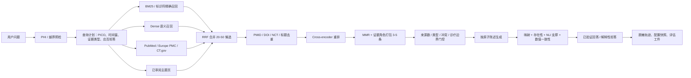

# Clinical Evidence Assistant 详细优化方案

> 依据：`D1AM.pdf`（项目定调、数据、伦理、评估）与 `D1PM.pdf`（RAG、混合检索、重排、幻觉防御、LLM Wiki）。
> 页码均按 PDF 页序。本文面向当前仓库的下一轮优化，目标不是堆叠技术名词，而是让“问题 -> 证据 -> 带引用回答 / 证据不足拒答”成为可复现、可审计、可评估的工程闭环。

## 1. 执行摘要

当前项目已经超过“最小演示原型”阶段：有 500 篇本地 PDF 索引、18,002 个 chunk、多源检索、RRF、重排、结构化生成、引用校验、拒答、固定题集和 Streamlit UI。现有 35 个单元测试与冒烟测试均通过，固定离线评估也能稳定运行。

下一轮不应优先增加 Agent 或更多 UI，而应先修复四个可信度缺口：

1. **回答校验仍可能放行未获支持的段落。** `citation_check.py` 会标记 `stripped_paragraphs`，但 `pipeline.py` 没有真正删除这些段落；只要总体失败比例不超过阈值，UI 仍可能展示它们。
2. **500 篇不等于高质量、均衡知识库。** 当前本地库中血脂 307 篇、糖尿病 113 篇，而高血压仅 8 篇、脑卒中仅 5 篇；399/500 篇证据等级为 `Other`，不足以稳定组成“指南 + 系统综述 + 代表性 RCT + 边界证据”的互补证据包。
3. **当前评估分数高，但判定标准偏弱。** Recall/MRR/nDCG 主要按 `topic` 是否相同判相关，引用准确率把正确拒答题也计为 1.0，关键点覆盖只检查词项是否重叠；因此 100% Recall@8 和 100% 引用准确率适合作为工程回归，不足以证明真实证据质量。
4. **拒答、安全和可复现性尚未形成统一策略。** 当前前置拒答主要看领域、虚构词和 Top-1 分数，尚未完整覆盖“来源少于 3 个、缺预期证据类型、证据冲突、个体化用药/停药请求”等材料要求，也没有在外部 API/LLM 调用前执行 PHI 检测与出站控制。

建议按以下顺序推进：

- **P0：先修可信度底线。** 原子陈述校验、四规则拒答、语料质量报告、公平 A/B 评估。
- **P1：再提升检索上限。** 查询计划、20-50 候选召回、跨编码器重排、MMR/证据角色、章节级切分、Wiki 维护闭环。
- **P2：最后做产品化。** 支撑矩阵、冲突展示、PHI 出站保护、可观测性、配置版本和演示报告。

### 1.1 实施状态（2026-08-11）

| 项目 | 状态 | 已落地内容 |
|---|---|---|
| 原子陈述与输出净化 | 已完成 | 生成协议支持 claim 类型/确定性；校验失败的陈述和引用在 UI 前删除 |
| 引用与数字一致性 | 已完成 | 检查 evidence map、来源存在性、词项支持和数字/年份/百分比一致性 |
| 解释性拒答 | 已完成 | 稳定原因码；展示已找到、缺少和下一步；独立来源/证据类型门控 |
| PHI 与个体化诊疗预检 | 已完成 | 在检索和外部调用前阻断可识别信息、剂量、停药和换药请求 |
| 跨来源去重与互补证据包 | 已完成（轻量版） | PMID/DOI/NCT 规范身份；Top-8 中选择 overview/causal/boundary Top-5 |
| 语料质量审计 | 已完成（第一版） | `audit_corpus.py`、`corpus_quality.json`、知识页 schema lint |
| A/B/C 统一入口 | 已完成（协议版） | 锁定模型、温度、语料版本和 schema；保存所有原始工件 |
| Dense embedding / cross-encoder | 工程接入完成，模型评测待完成 | 已实现版本化稠密索引、分查询向量召回、混合 RRF、交叉编码器适配器和 legacy 降级；尚待 48 题 qrels 与候选模型实测 |
| 40+ 题文献级 qrels | 待实施 | 当前 15 题继续作为工程回归集，不能宣称临床验证 |
| 完整 corpus manifest / 授权台账 | 待实施 | 当前质量报告已暴露分布和分类缺口，尚未补齐 license/checksum/查询日志 |
| 独立 NLI/LLM judge 与 Wiki Ingest/Query/Lint 全闭环 | 部分完成 | 已预留支持性接口并实现 schema lint，尚未接独立模型和维护日志 |

严格口径回归结果：Recall@8 75.0%、MRR 95.8%、nDCG@8 75.5%、引用准确率 100%、受支持陈述率 100%、关键点覆盖率 80.0%、拒答正确率 100%。Recall 与 nDCG 的下降来自改用唯一文献/知识页 `relevant_source_ids` 和完整 qrels 分母，属于评估口径修正，不是代码回归。

## 2. 材料要求与当前实现对照

| 材料要求 | 依据 | 当前实现 | 判断 | 优先级 |
|---|---|---|---|---|
| 问题先改写成可检索、可核验的 PICO/证据问题 | D1AM p.14、p.39；D1PM p.43 | `query_rewrite.py` 有规则词典、基础 PICO、中英文扩展、时间窗和预期证据类型 | 已完成轻量查询计划；结局抽取仍可继续增强 | P1 |
| 数据 API 为主、样例兜底，基础库不少于 500 篇 | D1AM p.7、pp.44-51 | PubMed、Europe PMC、ClinicalTrials.gov；本地 500 篇 PDF | 数量达标，质量与领域分布不均 | P0 |
| `id/title/year/source_type/text/url` 可回查元数据 | D1AM p.48；D1PM p.7、p.13 | `Document/Chunk/Entry` 覆盖大部分字段 | 缺 DOI、许可证、检索式版本、checksum、章节定位、证据角色等 | P0 |
| BM25 + 向量双路召回，RRF 按名次融合 | D1PM pp.17-20 | 默认 BM25 + TF-IDF；可选版本化稠密索引，并按独立查询变体与词法候选做 RRF | 工程接入完成；具体嵌入模型仍须在冻结开发集上选择 | P1 |
| 先召回 20-50，再重排到 Top-5 | D1PM pp.21-22 | `RETRIEVE_K=40`、`RERANK_K=8`、`GENERATION_K=5` 已分层；可选 CrossEncoder | 工程接入完成；尚待模型质量与延迟门禁 | P1 |
| 证据要互补，不是重复；总览/因果/边界各司其职 | D1AM p.15；D1PM pp.23-25 | PMID/DOI/NCT 跨源去重，NCT 研究家族、MMR 式去冗余与三角色证据包 | 阶段 2 轻量研究家族去重已完成；无注册号的家族识别仍可增强 | P1 |
| 每条事实紧跟引用，编号只能来自 evidence map | D1PM pp.27-28、pp.44-48 | 原子陈述、编号/存在/支持/数字校验、输出净化 | P0 已完成；后续可用独立 NLI 替换词项支持规则 | P0 |
| 四种情况触发拒答，并解释“找到什么、缺什么、下一步查什么” | D1PM pp.29-31 | 安全、独立来源、证据类型、冲突和后置门控 | P0 已完成，拒答率与错误拒答率仍需扩大题集评估 | P0 |
| Wiki 具备 Ingest / Query / Lint 维护闭环 | D1PM pp.33-41 | 5 个结构化知识页、15 个 claim、schema lint | lint 已完成；索引、反链、冲突日志和 Ingest 日志待实施 | P1 |
| A/B 固定同底座、同题集、同温度、同 Prompt，并保存原始输出 | D1AM pp.29-31、p.41；D1PM p.3、p.52 | `run_compare.py` 锁定配置并保存 A/B/C 原始工件 | 协议入口已完成；Arm A 仍需配置在线模型 Key 才能实际运行 | P0 |
| PHI、诊疗越界、Key、免责声明、AI 使用披露 | D1AM pp.53-60 | 外部调用前 PHI/个体化诊疗阻断，UI 紧急提示与免责声明 | 核心预检已完成；更完整的实体识别与审计日志仍属 P2 | P0/P2 |

## 3. 当前基线与问题定位

### 3.1 已有优势

- `EvidencePipeline` 已把改写、召回、统一候选、重排、前置拒答、生成、校验和后置拒答串成单一入口，符合 D1AM p.42 与 D1PM p.51 的证据链结构。
- 本地库可离线运行，且外部单源失败不会击穿整个链路，适合教学演示的“API 为主、离线兜底”。
- 文献 PDF 索引保留 PMID、页码和来源链接；500 篇中 480 篇为全文提取、20 篇摘要兜底。
- 生成接口使用结构化 JSON，引用编号只能来自检索结果；离线抽取生成器天然可审计。
- UI 已公开语料状态、实时 API 状态、引用卡片、检索轨迹和免责声明。
- 模块边界清楚，后续替换 embedding、reranker、NLI judge 时不必重写 UI。

### 3.2 必须正视的基线偏差

本地库当前分布如下：

| 维度 | 当前数据 |
|---|---:|
| 文档 / chunk | 500 / 18,002 |
| 全文 / 摘要兜底 | 480 / 20 |
| 血脂 / 糖尿病 / 心脑血管 | 307 / 113 / 44 |
| 高血压 / 脑卒中 / 其他 | 8 / 5 / 23 |
| Other / Review / RCT / Meta-analysis | 399 / 60 / 32 / 9 |
| 年份范围 | 2000-2025 |

这说明系统“规模达标”，但还没有证明“证据角色覆盖达标”。尤其是高血压与脑卒中恰好属于 UI 和测试集的核心领域，却在 PDF 主库中占比很低；知识页可以救回固定题，但长尾问题容易失效。

优化前离线评估结果为 Recall@8 100%、MRR 95.8%、nDCG@8 96.0%、引用准确率 100%、关键点覆盖率 89.6%、拒答正确率 100%。这些历史分数只保留作旧口径对照，并已被上文严格口径替代；其主要问题是：

- `relevant_topics` 只判断领域，不判断某篇文献是否真正回答该题；
- Recall@8 目前是“Top-8 是否至少有一个同主题条目”，不是真正的相关文献召回率；
- nDCG 的理想排序只基于已返回列表，缺少完整 qrels；
- 引用准确率未把 `existence` 纳入统计，且拒答题没有引用时直接记为 1.0；
- 关键点覆盖用词项交集判断，不能确认结论正确、数值一致或引用支持。

因此这些指标只能说明“代码路径没有回归”，不能用于宣称“临床效果已验证”或“RAG 胜过通用模型”。这与 D1AM p.58 的“允许专用未赢、诚实报告局限”一致。

## 4. 目标架构



关键变化是把 `Top-K` 拆成三个概念：

- `retrieve_k=40`：允许召回器有足够候选；
- `rerank_k=8`：用于审查、诊断和证据角色选择；
- `generate_k=5`：只把 3-5 个互补片段交给生成器，降低噪声和错误拼接风险（D1PM p.14）。

## 5. P0：可信度底线改造

### 5.1 从“段落 + 引用”改成“原子陈述 + 支撑关系”

**当前风险**

- `AnswerParagraph.text` 可能包含多个事实、数值和建议，一个 citation 列表无法说明每个来源具体支持哪句话。
- `_support()` 只看词项重叠；只要结论复用了证据里的术语，就可能误判为支持。
- `stripped_paragraphs` 只被记录，没有真正从 `answer.paragraphs` 删除。

**建议设计**

将生成协议改为：

```json
{
  "refused": false,
  "claims": [
    {
      "text": "一条可独立核验的事实性陈述",
      "citation_ids": [1, 3],
      "claim_type": "effect|recommendation|limitation|conflict",
      "certainty": "high|moderate|low"
    }
  ],
  "limitations": [],
  "missing_evidence": []
}
```

验证顺序：

1. 编号在本次 evidence map 中；
2. `source_id/url` 可回查，PMID/DOI/NCT 格式与来源一致；
3. 对 claim 与每个证据片段运行 NLI/LLM judge，输出 `entailed / partial / contradicted / unknown`；
4. 单独检查数字、样本量、年份、剂量、效应方向是否一致；
5. 仅保留至少有一个 `entailed` 证据的 claim；
6. 被支持比例不足、核心 claim 被删除或出现未解释冲突时，转解释性拒答。

**必须先做的最小修复**

- 在暂未接入 NLI 前，`pipeline.py` 必须真正移除 `check.stripped_paragraphs`；不得只在 trace 中记录。
- 若任一含数值/用药/风险结论的段落无直接支持，立即删除该段或整体拒答，不受 50% 总失败阈值豁免。
- UI 只渲染净化后的 answer，并展示“校验前 N 条、删除 M 条、最终 K 条”。

**验收标准**

- 构造“真实 PMID + 不被其支持的精确数字”测试，最终 UI 不显示该数字。
- 构造 2 条段落中 1 条无支持的答案，失败段落被删除而不是继续显示。
- 100% 最终事实 claim 至少映射一个 `entailed` 证据；`unknown/contradicted` 不得出现在正常回答中。

涉及文件：`schemas.py`、`generate.py`、`citation_check.py`、`pipeline.py`、`app.py`、`tests/test_citation_check.py`。

### 5.2 实现四规则证据门控与解释性拒答

依据 D1PM pp.29-31，建议新增 `EvidenceGateResult`，至少包含：

- `source_count`：独立文献/指南少于 3 个时，不下确定结论；“独立”按 PMID/DOI/NCT/指南章节去重，不按 chunk 数量。
- `expected_types`：查询计划需要指南、系统综述或 RCT，而候选包未命中时，明确标记证据类型不足。
- `conflicts`：相似人群/干预/结局的证据方向冲突时，并列呈现，不由模型擅自选边。
- `clinical_boundary`：询问具体药名、剂量、停药或个体处方时，拒绝个体化建议，只提供公开证据摘要与就医提示。

合格拒答必须输出三个字段：

1. **已找到什么**：例如“找到 2 项观察性研究”；
2. **还缺什么**：例如“未找到目标人群的 RCT 或近期指南”；
3. **下一步查什么**：给出证据类型和改写后的检索方向，不给诊疗方案。

不要把所有失败都写成“相关性不足”。拒答原因要可枚举，例如 `OUT_OF_SCOPE`、`PHI_BLOCKED`、`LOW_RELEVANCE`、`INSUFFICIENT_SOURCES`、`MISSING_EVIDENCE_TYPE`、`UNRESOLVED_CONFLICT`、`PERSONALIZED_TREATMENT`、`CITATION_FAILURE`。

**验收标准**

- 测试集中至少有：2 条证据不足、2 条冲突、2 条个体用药、2 条领域外、2 条伪造标识符问题。
- 每种拒答都包含“找到/缺少/下一步”，拒答率与错误放行率同时报告。
- 目标不是拒答越多越好；报告回答覆盖率、正确拒答率和错误拒答率。

### 5.3 把“500 篇”升级为可审计语料版本

新建机器可读的 `corpus_manifest.json` 或 SQLite 元数据表，每次建库保存：

- `corpus_version`、创建时间、代码 commit、检索式版本；
- 每次 API 查询、查询时间、命中数、保留数、失败源；
- 文档 `source_id`、PMID/DOI/NCT、规范化标题、年份、来源类型、URL；
- `retrieved_at`、原始来源、许可证/授权状态、文件 checksum；
- 提取状态、页数、chunk 数、OCR/摘要兜底原因；
- 领域、证据等级、证据角色、是否人工审核；
- 去重、排除和更新日志。

先对当前 500 篇做质量门禁：

- PMID/DOI/NCT 主键去重，标题归一化二次去重；
- 空摘要、撤稿/更正、非目标人群、付费墙授权不明内容单独标记；
- 领域分布不能依赖自动主题分类结果直接宣称覆盖；至少人工抽查每类 10 篇；
- 核心领域建立最小证据角色配额。建议每个目标主题至少有近期指南/共识 3-5 条、系统综述/Meta 5-10 条、代表性 RCT 5-10 条；不可获得时记录“缺口”，不伪造均衡；
- 报告 500 篇中的有效文档数、独立研究数、可引用 chunk 数、各角色覆盖率，而不是只报文件数。

**验收标准**

- 任一回答使用的条目都能回查到 manifest、原文 locator 和语料版本。
- `Other` 占比需要被解释或重新分类；至少对最终 Top-K 中的 `Other` 进行动态识别/人工抽查。
- 高血压与脑卒中不再只靠 5 个知识页支撑长尾检索；若暂时无法补齐，UI 明示领域覆盖差异。

### 5.4 重建公平的 A/B/C 评估编排

建议新增统一 `eval/run_compare.py`：同一题只加载一次配置，然后执行：

- Arm A：无外部检索的纯 LLM；
- Arm B：正常 RAG；
- Arm C：劣化 RAG，可注入召回不足、噪声或过时证据。

固定并保存：模型名、模型快照、温度、seed（如支持）、回答 schema、系统安全规则、题集版本、语料版本、运行日期。Arm A 与 B 的差异只能是是否提供检索证据以及与证据相关的必要指令；不得让一个 Prompt 要求“编参考文献”，另一个只允许从 evidence map 引用。

每题保存：原始回答、检索候选、最终 evidence map、生成编号、验证结果、拒答原因、延迟、token/费用。最终输出 JSONL、CSV 和可视化报告。

评估应拆成四层：

| 层 | 指标 | 判定方式 |
|---|---|---|
| 召回 | Recall@K、MRR、nDCG、证据类型命中率 | 人工建立 qrels，至少标到文献/指南条目 |
| 证据包 | 独立来源数、重复率、角色覆盖率、冲突覆盖率 | 程序化 + 人工抽查 |
| 生成 | 原子陈述支持率、数字一致率、引用存在率、关键点完整性 | 程序化 + NLI/LLM judge + 人工复核 |
| 产品安全 | 正确性、完整性、安全、清晰、合理拒答、错误拒答 | 盲评 rubric |

测试集从 15 条扩为至少 40 条：事实/指南/争议/最新证据/标识符精确检索/证据不足/冲突/个体化用药/PHI/领域外各有覆盖。每题补充 `expected_evidence_type`、`should_abstain`、`required_points`、`forbidden_claims`、`relevant_source_ids` 和 `notes`。

**验收标准**

- A/B/C 用同一命令运行并生成完整结果包。
- 评估报告允许 Arm B 未胜；不得只展示优势题。
- 结果同时报告均值、逐题明细、样本量、置信区间/Bootstrap 区间和失败案例。

## 6. P1：检索与知识组织优化

### 6.1 查询改写升级为 `QueryPlan`

当前 `_basic_pico()` 的结局固定为“临床获益、风险与适用条件”，不够精确。建议输出：

```json
{
  "population": [],
  "interventions": [],
  "comparators": [],
  "outcomes": [],
  "time_range": {"from": 2016, "to": 2026},
  "expected_evidence_types": ["Guideline", "SystematicReview", "RCT"],
  "identifier_terms": ["PMID", "DOI", "NCT"],
  "lexical_queries": [],
  "semantic_query": "",
  "needs_latest": false,
  "personalized_treatment": false,
  "out_of_scope": false
}
```

规则优先处理 PMID、DOI、NCT、药名、剂量和缩写；LLM 只负责结构化补全，失败时退回规则版。明确“最新/最近/当前”时必须调用实时源，不能因为本地 Top-1 分高就跳过 API。

### 6.2 分层召回、重排与互补证据包

建议实现：

1. BM25/FTS 负责精确术语、数字和标识符；
2. dense embedding 负责同义表达和口语改写；
3. 每路取 20-30，RRF 合并到 40；
4. PMID/DOI/NCT/规范化标题去重，同一文档最多保留 2 个 chunk；
5. cross-encoder 对问题与候选一起评分，取 Top-8；
6. MMR 去冗余，并按证据角色选择 3-5 条用于生成。

证据包目标不是“分数最高的 5 条”，而是尽量包含：

- 总览：近期指南或系统综述；
- 因果：代表性 RCT；
- 边界：观察性研究、特殊人群或外推限制；
- 冲突：方向不同且方法学可信的证据。

候选未召回时，重排无能为力；因此评估必须分开报告 recall 与 rerank，避免只调最终排序。

### 6.3 改进 PDF 切分与定位

当前按页、约 1,800 字符切分已经可用，但需要增加结构感知：

- PubMed 摘要保持“标题 + 摘要 + metadata”整体；
- 指南/PDF 优先按章节标题、推荐语句、段落切分；
- 表格与表注作为不可再分的单元，避免把一行数值与列标题拆开；
- 目标 300-500 token，10%-20% overlap，按文档类型配置而不是一刀切；
- chunk 保存 `page_number/section/paragraph/table_id/char_start/char_end`；
- 对扫描 PDF 记录 OCR 引擎、语言、置信度；低置信度 chunk 不直接支撑精确数值。

### 6.4 把知识页补成真正的 Wiki 工作流

保留现有 `data/knowledge_pages/*.json`，增加：

- `index.json`：主题、别名、反链、负责人、审核状态；
- `schema_version`、`updated_at`、`reviewed_at`、`reviewer`；
- claim 级 `source_ids`、适用范围、例外、冲突、证据确定性；
- `ingest_log.jsonl`：新来源如何影响哪些主题页；
- `lint`：失效链接、孤立页、缺字段、过期结论、冲突未标注、来源不存在；
- 原始来源只读，更新主题页时不得覆盖原文。

Wiki 负责高频稳定知识，RAG 负责长尾和刚更新问题；回答可先展示人工审核的主题结论，再显示本次实时补充证据（D1PM p.40）。

## 7. P2：产品、安全与可观测性

### 7.1 UI 信息层级

建议把结果页拆成四层：

1. **回答状态**：已验证 / 部分证据 / 证据不足 / 越界拒答；
2. **结论与边界**：每条原子陈述紧跟引用；冲突并列展示；
3. **证据包**：证据角色、等级、年份、来源、页码/章节、支持了哪条 claim；
4. **审计轨迹**：查询计划、各支路候选数、去重数、阈值、语料版本、模型版本。

拒答页面不能只显示错误消息，应展示已找到证据、缺失类型、建议补查方向。免责声明应默认可见，但不能替代对个体化诊疗问题的安全回应。

### 7.2 PHI 与外部出站保护

当前实时 API 和在线 LLM 可能接收用户原始问题；即使应用不持久化，也仍发生外部传输。必须在调用前：

- 检测姓名、病历号、完整生日、电话、身份证/证件号、地址、可识别叙事；
- 自动遮盖或阻止请求，并告知用户删除可识别信息；
- UI 明示“启用实时 API/在线模型会把脱敏后的检索词发送给第三方”；
- 只向检索 API 发送规范化医学关键词，不发送完整病例叙事；
- trace、错误日志、截图与评估工件使用脱敏版本；
- 缓存键继续使用 hash，缓存正文只保存公开检索结果。

增加演示前与提交前安全清单：无真实 PHI、无诊断/处方话术、免责声明可见、引用可回查、Key 未入库、AI 使用已披露（D1AM p.60）。

### 7.3 可观测性与配置

新增结构化 `RunRecord`：

- `run_id`、时间、模式、模型/检索器/阈值版本；
- 脱敏后的 query 与 QueryPlan；
- 每支路返回数、耗时、异常、cache hit；
- dedup 前后数量、rerank 分布、最终证据角色；
- 拒答码、claim 验证结果、总延迟、token/费用；
- corpus commit/checksum。

默认只在本地、短期保存且不存原始用户问题；用于演示的评估运行单独开启持久化。线上监控重点看：无结果率、错误拒答率、unsupported claim 拦截率、来源失败率、P95 延迟和陈旧缓存比例。

## 8. 分批实施计划

| 批次 | 目标 | 主要文件 | 预计工作量 | 退出条件 |
|---|---|---|---:|---|
| Batch 0 | 锁定基线与版本 | `docs/`、`eval/`、`data/corpus_version.json` | 0.5 天 | 现有测试、评估、语料统计可复现 |
| Batch 1 | 修复失败段落泄漏，改原子 claim | `schemas.py`、`generate.py`、`citation_check.py`、`pipeline.py`、`app.py` | 1-2 天 | 未支持事实不会显示；数值幻觉测试通过 |
| Batch 2 | 四规则门控与安全拒答 | `refusal.py`、`query_rewrite.py`、`app.py` | 1 天 | 解释性拒答和越界题通过 |
| Batch 3 | 语料 manifest、质量报告、再平衡 | `scripts/index_pdf_collection.py`、`scripts/collect_corpus.py`、`data/` | 1-2 天 | 覆盖、等级、去重、授权和缺口可审计 |
| Batch 4 | A/B/C 统一评估 | `eval/run_compare.py`、`eval/metrics.py`、`eval/test_set.json` | 1-2 天 | 同配置运行，保存逐题工件与盲评表 |
| Batch 5 | dense + cross-encoder + MMR/角色包 | `retrievers/`、`rerank.py`、`candidate_pool.py` | 2-3 天 | recall/rerank 分层指标提升且延迟达标 |
| Batch 6 | Wiki lint、PHI、可观测性与 UI | `knowledge_base.py`、`scripts/`、`app.py` | 2-3 天 | 维护闭环、安全清单与审计视图完成 |

如果只有 3 天，完成 Batch 0-4；不要在 claim 校验和公平评估未完成前投入 Agent、多轮自主检索或复杂前端。

## 9. 测试策略

### 9.1 单元测试

- QueryPlan：中文/英文、同义词、时间窗、PMID/DOI/NCT、预期证据类型。
- 去重：同一 PMID 来自 PubMed、Europe PMC 和 PDF 时只算一个独立来源。
- 证据包：同类综述去冗余，指南/RCT/边界角色按约束选择。
- 引用：越界编号、空 citation、真实 ID 假内容、数字不一致、冲突证据。
- 拒答：来源不足、类型不足、个体用药、PHI、领域外、模型主动拒答。
- Wiki lint：失效 URL、孤立页、缺更新时间、未标注冲突。

### 9.2 集成测试

- 离线全链路、三种检索模式、单源超时/429/坏 JSON、LLM 非法 JSON、缓存过期。
- `retrieve_k/rerank_k/generate_k` 各阶段数量与排序稳定。
- 所有最终 claim 均能从 UI 跳到对应 PMID/DOI/NCT/章节。
- PHI 不进入 API 请求、trace、cache 或评估输出。

### 9.3 回归与人工评审

- 现有 15 题保留为快速 smoke；新增 40+ 题作为正式比较集。
- 每次发布抽查至少 10 题的 evidence map 与 claim 支撑关系。
- 争议题由两名评审独立评分；记录分歧并仲裁。
- 任何阈值、模型或语料更新都必须重新校准，不得复用旧绝对阈值。

## 10. 发布门禁（Definition of Done）

### 必须满足

- [ ] 可重复运行的本地/实时数据管道与查询日志。
- [ ] 有效知识库不少于 500 篇，并公开领域、证据等级、全文/兜底和授权统计。
- [ ] 至少 8 条稳定演示题，正式评估不少于 40 条，包含证据不足、冲突、PHI 和越界题。
- [ ] 正文每条事实 claim 紧跟引用，引用只能来自本次 evidence map。
- [ ] unsupported/contradicted claim 在 UI 中为零。
- [ ] 拒答说明“找到什么、缺什么、下一步查什么”。
- [ ] A/B/C 同底座、同题集、同温度、同安全 schema，保存所有原始工件。
- [ ] README 与 UI 默认显示教学/研究用途、非诊疗、非个性化建议、PHI 禁止和紧急情况提示。
- [ ] Key、真实 PHI、受限原文和未脱敏日志不进入仓库。
- [ ] 单元测试、冒烟测试、离线评估和人工抽查全部通过。

### 建议指标门槛

- 引用映射准确率：100%。
- 原子陈述支持率：最终展示内容 100%。
- 标识符存在率：100%。
- 数值一致率：100%。
- 正确拒答率与错误拒答率：同时报告，不以单一高拒答率为目标。
- 证据包重复率：低于 20%，且回答型问题尽量覆盖至少 2 种证据角色。
- P95 离线延迟和实时延迟分别设门槛；性能退化超过 20% 必须解释。

## 11. 不建议现在做的事

- 不要先引入 Agent 自动多轮搜索。Agent 不能替代引用纪律和拒答门控（D1PM p.54）。
- 不要把 Top-K 调大当作安全措施。边缘证据越多，越容易被拼成完整但错误的答案（D1PM p.14）。
- 不要只换 embedding 模型而不重做 qrels、阈值和评估；分数分布会改变。
- 不要用“有 `[1]`”代替“引用存在且支持该 claim”。
- 不要把免责声明当作个体诊疗问题的免责开关。
- 不要只展示成功题、隐藏拒答、超时和专用系统未胜的结果。

## 12. 推荐的近期交付物

下一轮迭代完成后，仓库应至少新增或更新：

1. `docs/optimization_plan.md`：本方案与完成状态；
2. `docs/evaluation_protocol.md`：A/B/C、rubric、qrels 与统计口径；
3. `data/corpus_manifest.json`：语料版本、分布、来源与构建信息；
4. `eval/run_compare.py`：统一比较入口；
5. `eval/test_set_v2.jsonl`：40+ 题及可核验标签；
6. `scripts/lint_knowledge_pages.py`：Wiki 链接、字段、更新和冲突检查；
7. `data/eval_results/<run_id>/`：原始输出、evidence map、逐题评分和汇总报告；
8. 更新后的 UI：claim 级引用、证据角色、解释性拒答和审计轨迹。

完成这些之后，再评估是否需要 Agent、MCP/Tool 编排、在线向量库或更复杂的多角色评审。项目的核心竞争力应是“每句话为什么能说、什么时候不能说、结果如何被独立复查”，而不是回答长度或技术组件数量。
