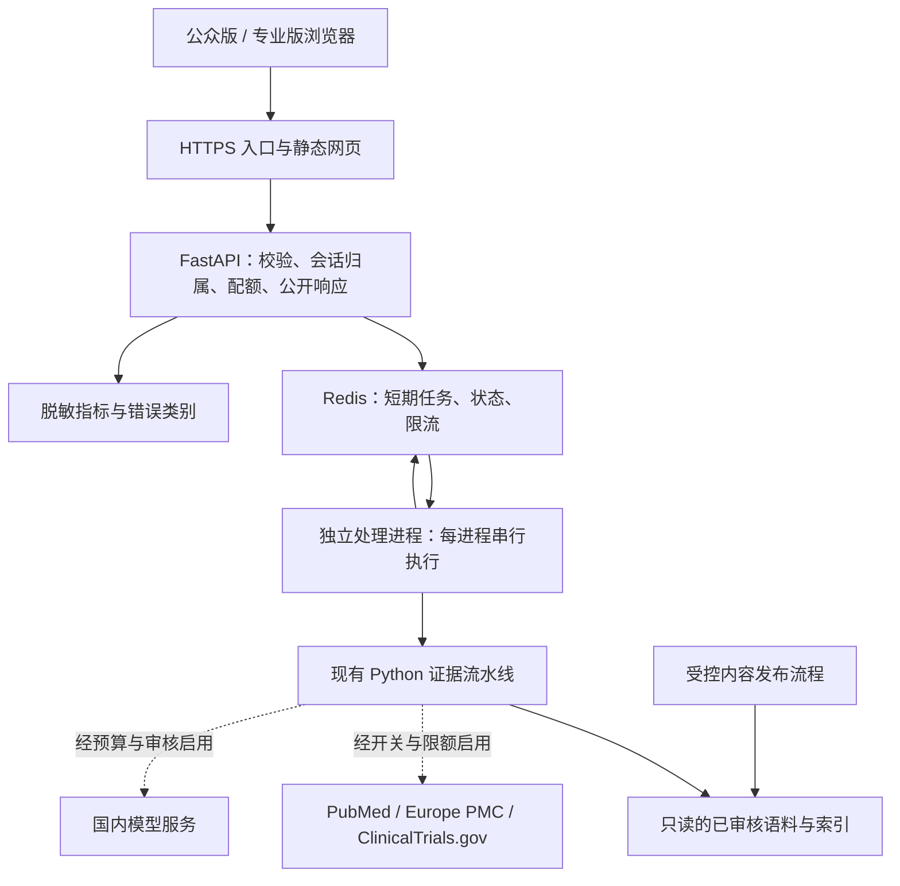

# 循证知问：公众网站初步设计

日期：2026-09-29 · 状态：设计初稿，供评审 · 范围：产品、页面、服务架构与服务器部署

### 原型范围确认记录（2026-09-29）

用户已确认制作以下可点击原型：首页与双入口；公众版示例提问、回答、引用和反馈；专业版 PICO 与证据列表；主题库列表和详情；方法与来源及隐私说明；加载、证据不足、隐私拦截和繁忙状态。采用青绿色风格，适配电脑和手机，使用本地示例数据。

登录、收藏、支付、文件上传、真实模型调用和服务器部署留待后续阶段。本次确认针对原型范围，不等于确认采购、正式上线或全文档中的所有架构参数。

原型入口：[index.html](</Users/yangxuesong/Clinical Evidence Assistant/docs/prototypes/public-website/index.html>)；体验说明：[README](</Users/yangxuesong/Clinical Evidence Assistant/docs/prototypes/public-website/README.md>)。

## 1. 设计结论

建议保留现有 Python 证据引擎，新增独立网页前端和 Web API，以 **“公众版 + 专业版”两个入口、一个证据底座** 提供服务。首版采用中国大陆单台云服务器、容器部署、本地已审核证据库，并按预算接入国内模型服务和外部文献检索。

首版的核心体验是：用户选择入口、提出范围内的一般问题、看到带编号引用的回答，并能核对来源和适用边界。专业版是表达与操作方式的选择，不代表医生身份认证，也不赋予额外诊疗权限。

### 已确认与设计假设

| 项目 | 内容 | 状态 |
|---|---|---|
| 目标 | 将当前项目转为公众可访问、可部署到服务器的网站 | 用户已确认 |
| 用户 | 普通公众与医生、医学生、科研人员；分别提供入口 | 用户已确认 |
| 地区 | 优先服务中国大陆用户，尚未购买服务器 | 用户已确认 |
| 首版运营 | 中文、免费小规模试用、免注册、暂不保存历史问答 | 本稿建议，可调整 |
| 首版覆盖 | 沿用现有成人高血压、血脂、糖尿病、卒中二级预防及生活方式主题 | 本稿建议 |
| 资源 | 使用 CPU 检索和远程模型 API，暂不部署本地大模型 | 本稿建议 |
| 业务主体 | 个人或机构主体、域名、月度预算、内容评审负责人尚未确定 | 部署采购与正式开放前确定 |

本次交付是初步设计；文中新增页面、接口、监控与部署设施均为拟建能力。未购买云资源，未修改产品代码，未执行部署。

## 2. 当前基础与网站化缺口

审查基于当前仓库提交 `2d8be49` 及工作区源码。2026-09-23 的 P0 报告是已有评测记录，本次没有重新运行质量评测。

| 当前实际情况 | 网站设计中的处理 |
|---|---|
| `app.py` 已提供 Streamlit 提问、答案、引用和调试轨迹 | 保留为内部演示与评测入口；公开网站使用面向两类用户的页面 |
| `EvidencePipeline` 已串联安全预检、检索、证据包、生成、引用校验和净化 | 复用主流程；公开 Web 层增加资源控制与响应字段筛选 |
| `ClinicalEvidenceTool` 会对共享流水线加锁；当前 Streamlit 缓存的流水线直接接受调用 | 初期每个处理进程串行使用独立流水线，禁止跨用户并行操作同一实例 |
| 外部来源限流是进程内状态；缓存临时文件名固定 | 改为跨进程统一限流；缓存写入采用锁和唯一临时文件或统一缓存服务 |
| Tool 返回完整题干、证据原文、查询计划、trace 等字段 | 新建公开响应模型，仅返回产品必需字段 |
| 内置只有 5 个知识页与 10 条文献快照；本地 PDF 不属于发布包 | 展示真实主题范围；制作独立、可授权发布的生产语料包 |
| P0 尚有语料质量失败项、独立临床评审缺口 | 自由问答公开前完成对应质量门禁；现有回归分数不作为医学正确率宣传 |
| CI 覆盖 Python、MCP 与离线 smoke；尚无服务器部署配置 | 增加容器、Web 接口与浏览器验收、部署健康检查和回滚 |

依据：[当前 UI](</Users/yangxuesong/Clinical Evidence Assistant/app.py:74>)、[Tool 的请求锁](</Users/yangxuesong/Clinical Evidence Assistant/src/evidence_assistant/tool.py:40>)、[缓存与来源限流](</Users/yangxuesong/Clinical Evidence Assistant/src/evidence_assistant/retrievers/common.py:21>)、[内部返回结构](</Users/yangxuesong/Clinical Evidence Assistant/src/evidence_assistant/schemas.py:151>)、[P0 实施报告](</Users/yangxuesong/Clinical Evidence Assistant/docs/optimization_p0_implementation_report.md>)。

## 3. 三种方案与推荐

| 方案 | 优点 | 代价与适用范围 |
|---|---|---|
| **A. 独立前端 + Python API，推荐** | 可清晰设计双入口、移动端和证据卡片；保留现有核心；方便控制公开数据与资源 | 需要新增前端、API 与部署设施，适合持续运营 |
| B. 改造 Streamlit 后部署 | 初期改动少、能快速邀请试用 | 仍需解决共享状态、限流和公开响应问题；双入口和移动端体验的定制空间较小 |
| C. 托管前端 + 多个云服务 | 便于独立扩容和托管运维 | 国内访问、供应商依赖和数据路径更复杂，初期成本与排障面增加 |

选择 A 的理由：当前已具备框架独立的 Python 核心，双人群的网站体验是主要新增工作。前端采用 React + TypeScript + Vite；公开介绍及主题页预渲染为静态 HTML，问答工作台采用客户端交互。这样兼顾内容页的可访问性、搜索收录与部署简单性。搜索引擎不收录私人问答结果。

## 4. 产品与页面设计

### 4.1 首版功能范围

| 功能 | 公众版 | 专业版 |
|---|---|---|
| 提问 | 日常语言输入，提供一般健康知识示例 | 自由输入，可展开人群、干预、对照、结局四项检索条件 |
| 回答 | 简短解释、适用范围、研究尚不能确定的内容 | 证据摘要、研究类型、对象与结局、局限及来源 |
| 引用 | 正文编号，点开查看易读来源卡片 | 正文编号、PMID/DOI/NCT、年份、研究状态和有权展示的证据片段 |
| 主题库 | 通俗知识页 | 同主题的证据与研究说明 |
| 最新资料 | 显示本次证据日期和是否完成在线检索 | 可提出“查找最新研究”，实际检索仍受服务端策略控制 |
| 拒答与故障 | 说明原因，并给出一般问题的改写提示 | 增加可核实的证据缺口说明 |
| 反馈 | 结构化“引用打不开／难理解／疑似错误”等标签 | 同左 |

两版共用相同的隐私、诊疗边界和引用要求。专业版选择器不控制管理权限。首版账号、云端收藏、问答分享、文件上传、付费、社区和多轮患者咨询列入后续范围，减少需要管理的用户数据。

### 4.2 信息架构

| 页面 | 地址建议 | 主要内容 |
|---|---|---|
| 首页 | `/` | 定位、双入口、主题范围、使用方法、数据说明 |
| 公众问答 | `/ask` | 简单提问、易读回答、证据与边界 |
| 专业工作台 | `/professional` | 问题与可选 PICO 条件、证据摘要、来源列表 |
| 主题库 | `/topics`、`/topics/:slug` | 经审核的主题介绍、引用、适用范围、更新时间 |
| 方法与来源 | `/methodology` | 证据来源、更新方式、引用校验的能力和局限 |
| 隐私与服务规则 | `/privacy`、`/terms` | 输入处理、临时保存、外部服务、使用规则 |
| 联系与反馈 | `/contact` | 运营主体、投诉渠道、处理时限 |

网站管理首期沿用受控发布流程，不额外建设公开管理后台。运营人员通过私有管理通道查看监控、处理反馈、发布已审核内容。

### 4.3 首页线框

```text
循证知问                     主题库  方法与来源  专业版

让健康信息有据可查
了解研究说了什么，也看清它适用于谁。

[ 公众版：了解健康知识 ]       [ 专业版：检索临床证据 ]

当前覆盖
高血压    血脂管理    糖尿病    卒中二级预防    生活方式

如何使用
提出一般问题  →  阅读证据摘要  →  展开引用核对来源

已审核主题卡片                数据来源与最近更新说明

关于我们  隐私  服务规则  投诉渠道  备案信息（完成后展示）
```

首页主文案避免“全科问诊”“自动治疗方案”“医学准确率 95%”等超出现有证据的承诺。题库卡片只展示实际发布的主题，缺少内容时不显示虚假的数量。

### 4.4 公众版线框

```text
循证知问 / 公众版                         切换到专业版

你想了解什么健康知识？
提示：请提出一般知识问题，避免填写姓名、病历号等信息。
[ 例如：关于早晨和晚间服用降压药，研究发现了什么？       ]
[ 查找证据 ]               当前范围说明 / 示例问题

状态：正在查找来源 → 正在核对引用

┌ 易读解释 ─────────────────────────────────┐
│ 简短回答，每个事实结论附 [1] [2] 等引用。              │
│ 适用于哪些人群；目前还不能确定什么。                  │
└───────────────────────────────────────────┘
资料截至 / 本次是否完成在线检索 / AI 生成标识（适用时）

[ 查看证据来源 ]    [ 这个回答难理解 ]    [ 报告问题 ]
固定提示：内容用于健康知识学习，个体诊疗需咨询专业人员。
```

线框中的问题仅示意输入方式，发布前须核验对应证据及回答。首版采用一次提问一次回答；页面刷新后不恢复历史问答。

### 4.5 专业版线框

```text
循证知问 / 专业版                  主题库  方法与来源

左侧：问题与条件                   右侧：本次证据摘要
临床学习或研究问题                 回答段落 + 编号引用
[ 问题输入框             ]        适用人群 / 研究局限
[ 展开 PICO 条件         ]        文献日期 / 检索完成情况
[ 检索证据               ]

下方：引用来源
[1] 文献标题 | 年份 | 研究类型 | 已发表/注册/预印本等状态
    可展示的支持片段、原始来源链接、标识符
[2] ……
```

PICO 是检索提示，不是病例采集表。研究类型与证据确定性分别表达；没有经验证的分级结果时显示“未独立评定”，不直接把当前 `certainty="moderate"` 默认值包装成专业证据评级。

### 4.6 视觉与交互

- 延用当前品牌“循证知问”，以深青色 `#0B7B75` 为主色、浅灰绿为背景、深色正文；警示采用琥珀色，错误采用红色。
- 公众版以单栏阅读为主；专业版桌面端采用问题区与结果区分栏，手机端统一变为单栏。
- 正文建议 16–18 px，段落行距 1.6–1.8；桌面最大内容宽度约 1,160 px。颜色和字号在原型阶段验证可读性。
- 来源卡片支持键盘操作和可见焦点；加载、拒答、降级状态同时使用文字，避免只靠颜色区分。
- 切换入口时保留本地已输入的草稿；已有结果保留原模式标签，只有用户明确重新提交才按另一模式生成，避免静默产生费用。
- 用户端呈现“本次未能更新在线资料，以下基于截至某日的证据”；检索后端名称、相关分、异常堆栈留在内部诊断。

## 5. 回答生成与公开信息边界

### 5.1 两类表达共用证据约束

处理链路：输入与范围检查 → 证据检索 → 来源及证据包检查 → 按所选入口生成原子陈述 → 引用、数字、单位和支持性检查 → 净化 → 返回最终回答。

公众版的通俗改写必须在最终校验之前完成，保留陈述与引用的映射；不能对已校验答案再做一次无校验的“润色”。专业版的事实型小结也必须进入可校验的陈述字段。当前固定生成提示词需要扩展，不能仅靠 CSS 隐藏术语实现公众版。

若公众版生成未通过校验，回退到同样通过检查的已审核主题内容或明确说明暂时无法回答。切换入口不能放宽拒答阈值。未校验的生成内容不向浏览器逐字推送；等待期间只显示真实处理阶段。

### 5.2 公开结果字段

拟建 `PublicAnswer` 采用字段白名单，包含：

- 任务 ID、模式、终态；经过净化的回答段落及引用编号。
- 来源题名、年份、文献类型、规范标识、经过 URL 检查的链接，以及授权允许的短片段。
- 适用范围和不确定性；这些事实性内容同样需要引用支持或人工审核。
- 语料版本、来源日期、在线更新完成情况、适用的 AI 内容标识。
- 用户可理解的拒答原因或故障文案；内部请求 ID 用于客服定位。

原问题、重写词、候选全文、内部 trace、供应商错误、文件路径和密钥不进入公开结果。原问题只在用户当前页面显示，不写入结果 URL。URL 只允许经过检查的 HTTP(S) 来源；证据和生成文本按安全文本/受限 Markdown 渲染。

`answered`、`refused` 与 `error` 分开：证据不足属于拒答；供应商失败后如仍能返回通过检查的抽取式回答，则为 `answered` 并标记降级与实际生成方式；无法完成安全处理的基础设施故障为 `error`。降级到本地资料的答案仍须通过证据检查，并展示实际资料日期。用户端分别标注“AI 生成摘要”和“来源摘录整理”，不把抽取回退冒充在线模型成功。

在线检索需新增逐来源的状态记录：是否尝试、是否成功、是否命中缓存、获取时间及返回数量。当前 `used_live_api` 只能说明尝试过该分支，不能直接用作“已更新”标志；成功且零结果与请求失败也须区分。所有来源失败显示“未完成在线更新”，部分成功显示“部分来源完成更新”，缓存日期不能冒充本次联网时间。

## 6. 技术架构



### 6.1 服务职责

| 模块 | 职责 | 初始部署 |
|---|---|---|
| 网页与 HTTPS 入口 | 静态资源、路由、TLS、请求体上限、基础防刷 | Nginx，1 个容器 |
| Web API | 校验、临时会话、任务归属、限额、结果筛选 | FastAPI，1 个 API 进程 |
| 问答处理 | 调用独立流水线、生成、校验与净化 | 2 个处理进程，每进程同时最多处理 1 个任务 |
| 短期任务服务 | 有界队列、状态、会话归属、来源限流与请求去重 | Redis，内网访问 |
| 语料 | 版本化知识页、精选快照及授权索引 | 本机只读卷；独立备份 |
| 内容与运维 | 内容审查、监控、限额调整、版本回滚 | 私有管理通道与发布脚本 |

任务状态与结果使用 Redis 短期保存，关闭该实例的 AOF/RDB 持久化；生产日志和备份不包含任务内容。按日累计的费用账本使用独立 SQLite 持久卷，仅保存金额、计量与任务 ID，不保存题干；费用预留和结算通过事务避免并发超额。配额服务或费用账本不可用时停止新增付费调用，避免重启后预算失效。

首版不新增用户业务数据库。反馈暂存结构化标签、请求 ID 和版本信息；投诉联络信息采用单独受控渠道。需要账号、收藏或多人内容审阅后，再引入业务数据库与细粒度授权。

Supabase 保留为已有可选证据连接器，首版默认关闭。已有 schema 对活动证据允许公开读取，不能直接把未确认公开展示权的全文迁入其中。密钥类型也不能替代数据权限设计。[Supabase 官方密钥说明](https://supabase.com/docs/guides/getting-started/api-keys)

### 6.2 一次请求的生命周期

1. API 检查长度、请求体、会话和配额，并运行本地隐私与范围预检；被阻断的题干不入队、不外发。
2. 通过检查的任务绑定不可预测 ID 与短期会话；API 返回 `202`，页面轮询状态。
3. 空闲处理进程领取任务，使用自己的流水线实例。原始输入及安全改写仅在处理所需的短期内存中存在；语料与模型配置由服务端确定。
4. 检索、生成与校验共用剩余时限；来源失败时按实际情况回退。处理进程只在校验完成后写入公开结果。
5. 浏览器获得最终结果。完成后立即删除排队输入；结果默认保留 10 分钟，超时删除。运行中任务也受硬截止时间限制。
6. 到期、取消和进程中断都有独立状态。重启导致的临时任务丢失提示用户重新提交，不伪装成成功，也不自动重复付费生成。

PHI 规则可能漏检，因此“通过预检”不等于输入已无隐私风险。首版不接受病历上传，境外检索只接收最小化的检索词；外部生成选择经确认的数据处理范围。供应商的数据保留政策须写入上线前核对项。

### 6.3 拟定 API

| 接口 | 用途与约束 |
|---|---|
| `POST /api/v1/queries` | 接受 `question`、`audience` 及可选一般性 PICO 字段；最终组合输入最多 4,000 字符；可接收幂等键 |
| `GET /api/v1/queries/:id` | 仅所属临时会话可读；返回排队、处理、终态或到期状态；响应禁止共享缓存 |
| `DELETE /api/v1/queries/:id` | 所属会话取消任务并清除临时结果；取消不保证上游已发生调用可退费 |
| `GET /api/v1/topics` | 返回已发布主题列表 |
| `GET /api/v1/topics/:slug` | 返回已审核、可公开的主题内容 |
| `POST /api/v1/feedback` | 接收受限枚举标签和当前请求 ID，设防刷限制 |
| `GET /health/live`、`GET /health/ready` | 基础存活、队列和语料就绪检查；不返回配置或依赖密钥 |

输入为空、超长或模式无效返回 `422`；超限返回 `429` 与重试提示；容量或依赖暂不可用返回 `503`。已接纳任务的失败通过终态 `error` 表达。跨会话查询未知或他人任务使用相同的不可见响应，避免暴露任务是否存在。

临时会话 Cookie 使用 `HttpOnly`、`Secure`、`SameSite`，写接口验证来源并防 CSRF。前后端同域；问答结果设置 `Cache-Control: no-store`，禁止被 CDN、浏览器持久缓存或服务工作线程缓存。幂等键与会话、规范化输入和模式绑定，避免双击重复调用。

### 6.4 并发与费用控制的初始参数

以下是待压测调整的设计值，不是已测容量：

- 同时执行 2 个问答任务，最多等待 4 个；等待超过 15 秒则返回繁忙状态。
- 执行最长 60 秒，总等待与执行最长 75 秒。处理进程的主管服务负责终止失控任务并重建进程；浏览器停止轮询不等于后台调用已取消。
- 将剩余时限传到检索、重试与生成调用；不能仅保留当前“每次 API 12 秒、多次重试、生成 45 秒”的各自超时。
- 匿名会话初始每日 10 次提交、每分钟 2 次；同一出口 IP 另设较宽的限额和异常检测，照顾校园或医院共享出口。IP 与会话限制用于控制滥用，不视为可靠身份认证。
- 配置每日模型费用硬上限。初始建议模型总输入最多 8,000 tokens、输出最多 1,500 tokens，每任务最多 1 次模型调用，失败后不自动重试付费生成；供应商必须能强制执行相应 token 上限。采用所选模型的实际分词计量，超长证据只在保持原文含义与引用定位的前提下选取，无法安全满足预算则回退。当前生成请求没有输出 token 上限，需要补齐。
- 入队前按输入、输出上限与已核对的单价事务性预留最坏费用，结束后按用量结算；供应商用量未知时保留最坏预留，避免低估。模型及价格发生变化须更新预算配置，必要时配合供应商侧额度；达到上限切到已审核内容浏览。每日预算金额在选定模型后确定。
- 来源限流按“供应商 + 出口 IP/API 凭证”统一计算，重试也计入限流。保留公开检索结果缓存，不建立跨用户的私人问答缓存。

## 7. 中国大陆服务器部署方案

### 7.1 资源建议

| 资源 | 首版建议 | 说明 |
|---|---|---|
| 云服务器 | 大陆地域、4 vCPU / 8 GB 内存、约 80 GB SSD | 作为压测起点；所购规格需要支持备案，具体地域按用户分布选择 |
| 操作系统 | 云厂商支持的 Ubuntu LTS 镜像 | 实施时确认受支持版本并锁定依赖 |
| 部署方式 | Docker Compose | 同机运行入口、API、处理进程与 Redis |
| 模型 | 国内托管的 OpenAI-compatible API | 验证 JSON 结构、中文质量、引用与数字输出，不把协议兼容等同效果兼容 |
| 文件 | 只读生产语料卷 + 独立备份位置 | 只部署经过质量与授权审查的资源 |
| 网络 | HTTPS，对外仅开放网站端口；管理端口限制来源 | Redis、处理进程和指标接口均为内部访问 |

Docker 官方支持通过 Compose 在单台服务器运行生产部署；自动重启、生产配置和升级过程仍需显式设置。[Docker 生产部署说明](https://docs.docker.com/compose/how-tos/production/)

单机方案存在停机窗口和单点故障，适合小规模试用。观察到持续排队后，先根据瓶颈调整处理进程和内存；需要更高可用性时再拆分处理节点与存储。增加进程会复制部分内存资源，应通过压测决定数量。[FastAPI 部署概念](https://fastapi.tiangolo.com/deployment/concepts/)

### 7.2 网络与数据源

浏览器仅访问本站及用户主动打开的原文链接。字体、脚本和关键静态资源由本站提供，避免把首页展示依赖于第三方公共 CDN。

本地知识库是基础能力；PubMed、Europe PMC 和 ClinicalTrials.gov 是可选增强。购买服务器后，从目标地域测试各来源的连通性、P95 时延和限流，再决定实时检索默认策略。不能提前保证外部来源在大陆的可用性。实时更新失败时，“最新”问题必须显示未完成更新。

国内模型可先评估阿里云百炼等具有兼容 API 的服务。选型比较的是固定题集上的支持率、公众版可读性、延迟和费用；采购时核对具体模型的部署地域、备案情况、数据保留政策和结构化输出能力。百炼官方提供兼容 API 与地域配置说明，但本稿不指定最终模型。[官方产品说明](https://help.aliyun.com/zh/model-studio/what-is-model-studio)

### 7.3 费用如何估算

月成本 = 服务器与带宽 + 域名摊销 + 备份/日志 + 模型输入输出费用 + 内容评审与维护投入。

用于估算的样例假设：每天 100 次有效生成、每次输入 6,000 tokens、输出 1,000 tokens，则 30 天约需输入 1,800 万、输出 300 万 tokens。将所选模型的实际单价代入即可；实际调用还会受到拒答、失败和重试影响。本稿不把样例用量当作当前实测数据，也不以促销云价格作为长期预算。

现阶段优先决定可承受的月预算，再据此设每日额度。可先不开放自由生成，仅上线已审核主题内容与小范围邀请试用，获得真实调用数据后调整预算。

### 7.4 发布与维护

- 构建时锁定 Python/前端依赖与镜像版本；显式选择生产配置，不复制本机 `.env`。
- 公共运行包排除测试工件、原始 PDF、开发缓存、密钥和未通过门禁的候选索引。
- CI 通过后生成不可变镜像；在预发布环境进行离线与在线 smoke，再切换生产版本。
- 配置 HTTPS 证书自动续期与到期告警；预发布验证续期路径，避免证书过期导致全站不可访问。
- 密钥从服务器受控配置注入，限制文件权限；生产 Web 进程不持有语料写入用的高权限凭证。
- 语料采用“构建 → 审核 → 校验 → 发布版本目录 → 原子切换”；保留上一个镜像与语料版本配对回滚。
- 每日备份公开语料、部署配置和最小费用账本；密钥使用独立受控备份，不随普通文件备份传播。定期验证恢复。
- 指标包括队列深度、成功/拒答/故障比例、降级率、P95、外部超时、每题与每日成本、语料版本。生产关闭包含原始题干和证据明文的调试 recorder。
- 原始题干不写入访问日志、异常平台或统计分析；安全审计需要哪些字段及保留时限，按实际运营义务单独确定并告知用户。

## 8. 内容、数据与大陆开放条件

### 8.1 内容可信度与授权

每个发布主题须具有引用、适用人群、局限、审核日期和审核状态；审核者身份仅在真实完成审核且获得展示授权后呈现。公众版增加通俗表达评审，检查是否把观察关联写成因果、是否扩大人群、是否遗漏关键限定条件。

内置 5 个主题可用于信息架构验证，但不足以支持“覆盖全部常见疾病”的定位。优先将这些主题各自整理成若干经审核的问题；具体数量由评审能力决定。无法支持的提问明确告知覆盖不足。

原文持有权、内部检索权与公开展示权分别记录。生产 manifest 为每项资源记录来源、获取日期、版本、允许用途和展示范围；授权未知的全文暂不用于公网产品。公开结果只返回获准展示的内容和链接，服务端隐藏全文不能自动解决其处理与再分发权限问题。

### 8.2 上线办理事项

1. **域名、主体与 ICP 备案。** 大陆节点部署网站应在对外提供服务前完成相应备案流程，服务器选择也须满足接入商要求。个人或机构主体将影响申请材料；在主体确定后核对是否涉及医疗健康信息等额外条件。[工信部办事说明](https://www.miit.gov.cn/jgsj/xgj/bszn/art/2008/art_0740df6dde6e4d1fb6626066f4787c33.html)、[接入商服务器要求](https://help.aliyun.com/zh/icp-filing/basic-icp-service/user-guide/icp-filing-server-access-information-check)
2. **生成式 AI 服务适用要求。** 面向境内公众的生成服务属于需要核对适用义务的情形；涉及备案、安全评估或登记的具体办理路径，应由运营主体依据实际功能向属地主管部门确认。使用已备案模型不等于网站全部手续已完成。[暂行办法](https://www.cac.gov.cn/2023-07/13/c_1690898327029107.htm)
3. **内容标识与服务信息。** 结果页预留明显的 AI 生成提示；输出文件或分享功能未来开放时一并设计适用的标识。产品说明页预留实际使用模型及备案信息；不填造假的编号。[生成合成内容标识办法](https://www.cac.gov.cn/2025-03/14/c_1743654684782215.htm)、[服务备案信息公告](https://www.cac.gov.cn/2024-04/02/c_1713729983803145.htm)
4. **隐私、投诉与医疗健康业务边界。** 发布实际的数据处理政策和投诉渠道；结合主体和最终服务范围核对公安联网备案、医疗健康信息服务及其他可能适用的要求。界面上的“仅供学习”提示不能替代对真实功能的审查。

上述是影响架构与排期的部署事项，不构成已获得资质或法律合规的判定。初步设计可以先完成，正式公开生成问答的日期取决于技术验收、内容评审与适用手续。

## 9. 分阶段交付与验收

| 阶段 | 交付 | 进入下一阶段的条件 |
|---|---|---|
| 设计与内容准备 | 双入口原型、首批主题内容、供应商/预算/主体选择 | 页面与范围确认，内容和数据责任明确 |
| 网站工程 | 前端、API、短期任务、限流、公开响应模型 | 原有核心回归和 Web 契约、隔离测试通过 |
| 小范围服务器试用 | 域名/HTTPS、预发布、监控、预算、回滚 | 实机网络与负载验收；生成和通俗改写评审通过 |
| 公开运行 | 两类入口、审核主题、受限额的一般问答、投诉机制 | 内容、工程及适用上线手续均达到开放要求 |

允许先发布经审核的主题库，并将自由问答保持在受控测试范围，直到其独立评审完成。不能以旧 15 题回归改善替代公开产品的质量验收。

### 首版最低验收清单

- **主流程：** 桌面和手机均能从两类入口完成提问、阅读、展开引用；空输入、超长、无证据、失联、限流和超时有明确状态。
- **结果约束：** 每条最终事实陈述具有有效支持引用；公众版改写纳入独立评审。研究类型、注册状态、资料日期和未知项如实展示。
- **隐私与会话：** 合成隐私输入在所有外部适配器调用前阻断；题干不进日志；猜测他人任务 ID 不得读到结果；TTL 与取消清除可验证。
- **并发：** 以至少 1、2、4、10 个同时提交场景测试队列、串行流水线和过载处理；验证多进程共享来源限流及同查询缓存写入。10 个同时提交不代表承诺同时执行 10 个生成。
- **费用：** 双击和网络重试不重复扣额度；进程/Redis 重启、用量返回缺失和达到预算上限时不继续无预算调用。
- **时延：** 初步目标为首页可用时间 3 秒内、提交后 1 秒内有状态反馈；在线任务 P95 争取 30 秒内、执行硬上限 60 秒。需固定地域、网络、题集与并发测量；离线成绩与在线成绩分报。
- **运营：** 能查看故障与预算，能关闭在线生成，能回滚镜像与语料，并完成一次备份恢复演练。
- **内容与开放：** 沿用项目已有的独立评测方案，补充公众表达和网站数据暴露场景；严重错误、引用伪造、隐私外发或数据串用均阻止开放相应能力。

质量依据：[现有评测方案](</Users/yangxuesong/Clinical Evidence Assistant/docs/evaluation_plan.md>)。设计中的时延与容量目标属于新建议，现有 P0 报告不证明已经达到这些公网目标。

## 10. 后续决策顺序

先确认本稿的首版范围，再制作首页、公众版、专业版和拒答/故障状态的可点击原型。随后确定运营主体、月预算与可用的内容评审人员，选定云地域和模型；据此编写具体开发计划及采购清单。

首版完成后，再依据真实使用量决定是否增加登录、收藏、多轮研究会话、更大语料、多处理节点和内容管理后台。
