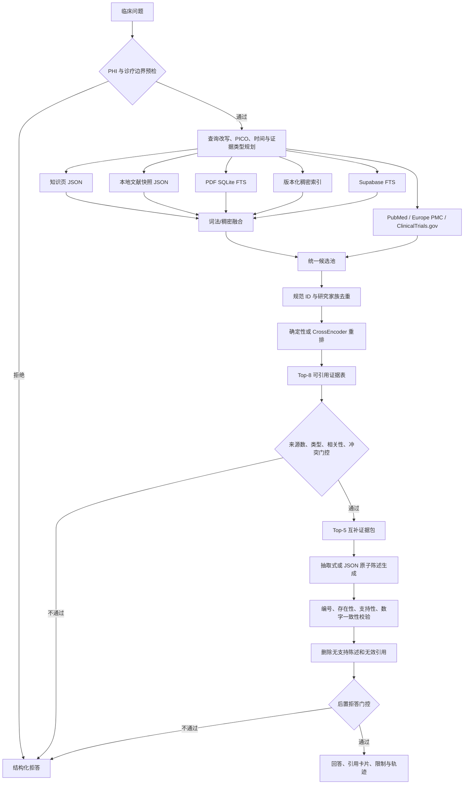

# Clinical Evidence Assistant 技术文档

> 项目名称：循证知问 · 临床证据助手  
> 当前版本：`0.1.0`  
> 语料版本：`v3`  
> 文档更新时间：2026-08-12  
> 项目性质：离线优先、引用可追溯的临床证据问答 MVP

## 1. 项目概述

Clinical Evidence Assistant 是一个面向临床学习与科研场景的循证问答系统。它将临床问题转化为中英文检索计划，从知识页、本地文献、PDF 全文索引、Supabase 和实时医学 API 中召回候选证据，再经过统一重排、证据门控、结构化生成和引用校验，输出带编号引用、证据等级、原始链接及完整检索轨迹的回答。

项目采用“离线优先”设计：不配置 API Key、在线模型或云数据库时，仍可运行 Web UI、Python Tool API、MCP 服务、测试和固定评估。可选在线组件不可用时，流水线会记录降级原因并回退到确定性本地实现。

项目仅用于教学与研究，不提供个体化诊断、处方、剂量调整、停药或换药建议，也不应接收可识别患者身份的信息。

## 2. 设计目标与非目标

### 2.1 设计目标

- 每条事实性结论都能映射到本次检索所得的具体证据条目。
- 在无网络、无密钥、无机器学习模型时保持核心流程可运行。
- 在证据不足、问题越界或引用不可靠时明确拒答。
- 允许替换检索、重排和生成后端，同时保持结果结构、校验和 UI 稳定。
- 提供 Web、Python 和 MCP 三种集成方式。
- 记录实际检索后端、重排后端、降级原因、耗时和逐步轨迹，便于审计。

### 2.2 非目标

- 不作为医疗器械或临床决策支持产品使用。
- 不替代执业医师的个体化评估。
- 不保存患者病历、身份信息或其他 PHI。
- 不承诺覆盖所有医学专科；当前规则与内置语料集中于成人心脑血管病、血脂、高血压和糖尿病。
- 不在请求主链路内下载模型、构建 PDF 索引或生成稠密向量索引。

## 3. 核心能力

| 能力 | 默认实现 | 可选增强 |
|---|---|---|
| 用户入口 | Streamlit Web UI、Python API | MCP stdio 服务、Agent Host 集成 |
| 查询理解 | 规则词典、中英文同义扩展、基础 PICO、时间意图识别 | 可扩展为 LLM 查询规划器 |
| 静态检索 | 知识页与文献快照的 BM25、TF-IDF 余弦、RRF | PDF SQLite FTS、Supabase FTS、版本化稠密检索 |
| 在线检索 | 默认关闭 | PubMed、Europe PMC、ClinicalTrials.gov API v2 |
| 候选处理 | PMID/DOI/NCT 规范化、研究家族去重 | 可接入更多文献身份解析器 |
| 重排 | 确定性加权重排 | sentence-transformers CrossEncoder |
| 生成 | 可审计的抽取式生成 | OpenAI-compatible Chat Completions JSON 生成 |
| 质量控制 | 安全预检、证据门控、引用映射/存在性/支持性/数字一致性检查 | 可替换为 NLI 或独立 LLM Judge |
| 数据层 | JSON、SQLite | Supabase Postgres + RLS + 原子发布 |

## 4. 技术栈

| 层级 | 技术 |
|---|---|
| 语言与运行时 | Python 3.9+；MCP 运行建议 Python 3.10+，项目推荐 Python 3.11 |
| Web UI | Streamlit 1.32+ |
| HTTP | requests 2.31+ |
| 本地全文处理 | PyMuPDF 1.24+、SQLite FTS5 |
| 默认检索算法 | 自实现 BM25、TF-IDF 余弦、Reciprocal Rank Fusion |
| 可选语义检索 | NumPy、sentence-transformers |
| 云端数据 | Supabase / PostgreSQL、GIN 全文索引、RLS、RPC |
| 工具协议 | MCP stdio，`mcp>=2,<3` |
| 测试与评估 | pytest、固定 qrels 测试集、自定义 Recall/MRR/nDCG 指标 |
| 构建与打包 | setuptools、`pyproject.toml`、editable install |
| CI | GitHub Actions，Python 3.9 与 3.11 矩阵 |

核心依赖保持较轻；Streamlit、MCP、开发工具和语义检索分别通过可选依赖安装。

## 5. 总体架构



### 5.1 请求生命周期

1. `query_rewrite.rewrite()` 清理输入、识别覆盖领域、生成基础 PICO、中英文检索词、预期证据类型和时间范围。
2. `refusal.assess_safety()` 在任何检索或外部请求之前检测 PHI、个体化诊疗请求、超领域问题和不可核验疗法。
3. `EvidencePipeline` 按检索模式查询知识页、本地快照、PDF、Supabase 及可选实时 API。
4. 静态候选按配置使用 `legacy`、`dense` 或 `hybrid` 后端。稠密后端失败时回退到本地词法候选。
5. `candidate_pool.build()` 将所有来源转换为统一 `Entry`，按规范来源 ID 去重，并限制同一研究家族最多两个片段。
6. 确定性或交叉编码器重排后，Top-8 条目获得稳定引用编号。
7. `assess_evidence()` 检查相关性、独立来源数、预期证据类型和未解释冲突。
8. `select_complementary()` 从 Top-8 中选择最多 5 条覆盖 `overview`、`causal`、`boundary` 角色的互补证据。
9. 生成器输出逐条可核验的原子陈述；未配置 LLM 时直接摘取证据文本。
10. `citation_check.verify()` 校验引用编号、来源存在性、文本支持性和数字一致性。
11. `sanitize_answer()` 物理移除无支持陈述与无效引用，随后执行后置拒答门控。
12. `PipelineResult` 返回回答、证据、门控结果、后端状态、降级原因、耗时及完整轨迹。

## 6. 代码结构

```text
.
├── app.py                              # Streamlit Web UI
├── config.py                           # 根目录兼容导出
├── src/evidence_assistant/
│   ├── pipeline.py                     # 主流水线编排
│   ├── schemas.py                      # 核心 dataclass 数据模型
│   ├── config.py                       # 环境变量与路径配置
│   ├── query_rewrite.py                # 查询改写、PICO、脱敏与范围识别
│   ├── refusal.py                      # 安全、证据和后置拒答规则
│   ├── candidate_pool.py               # 跨来源规范化与研究家族去重
│   ├── rerank.py                       # 确定性重排和互补证据包
│   ├── generate.py                     # LLM/抽取式结构化生成
│   ├── citation_check.py               # 引用校验和输出净化
│   ├── knowledge_base.py               # 知识页加载与词法检索
│   ├── index_registry.py               # 不可变稠密索引读写与完整性校验
│   ├── tool.py                         # 线程安全的 Python Tool API
│   ├── mcp_server.py                   # MCP stdio 服务
│   ├── retrievers/                     # 本地、PDF、云端、实时与稠密检索器
│   └── rerankers/                      # 确定性与 CrossEncoder 适配器
├── data/
│   ├── knowledge_pages/                # 人工维护的主题知识页
│   ├── raw/local_corpus.json           # 精选离线文献快照
│   ├── corpus_version.json             # 语料版本声明
│   └── corpus_quality.json             # 语料审计结果
├── scripts/                             # 索引、同步、审计、采集和核验工具
├── eval/                                # 固定题集、指标与 A/B/C 对比
├── tests/                               # 单元、集成、安全与回归测试
├── supabase/                            # 迁移、配置和 pgTAP 测试
└── docs/                                # 架构、评估、部署和规划文档
```

### 6.1 核心模块职责

| 模块 | 主要职责 |
|---|---|
| `pipeline.py` | 初始化后端、选择检索支路、编排门控、生成、校验和降级 |
| `schemas.py` | 定义查询、文档、片段、证据、答案、校验和流水线结果结构 |
| `query_rewrite.py` | 中英文扩展、领域识别、PICO、最新意图、PHI 脱敏与个体化请求识别 |
| `refusal.py` | 安全拒答、相关性/来源数/证据类型门控、生成后拒答 |
| `candidate_pool.py` | 将 `Document`/`Chunk` 统一为 `Entry`，提取 PMID/DOI/NCT，研究家族去重 |
| `rerank.py` | BM25、TF-IDF、检索分、来源先验和证据等级先验的确定性融合 |
| `generate.py` | 约束 LLM 只输出 JSON 原子陈述；失败时回退到抽取式回答 |
| `citation_check.py` | 验证编号存在、来源可回查、直接支持和数字一致，并净化最终输出 |
| `tool.py` | 输入验证、线程锁、JSON 序列化、Tool Schema 与状态字段 |
| `mcp_server.py` | 暴露 `query_clinical_evidence` MCP 工具并使用 stdio 传输 |

## 7. 核心数据模型

核心对象均定义在 `src/evidence_assistant/schemas.py`，并使用 dataclass 保持轻量、可序列化。

| 类型 | 用途 | 关键字段 |
|---|---|---|
| `QuerySpec` | 结构化查询计划 | `pico`、`api_queries`、`local_terms`、`domains`、`expected_evidence_types`、`needs_latest`、`contains_phi` |
| `Document` | 文献级实时或快照记录 | `id`、`source`、`title`、`abstract`、`evidence_level`、`status`、`url` |
| `Chunk` | 检索阶段的文本片段 | 文档元数据、`citations`、`retrieval_score` |
| `Entry` | 统一候选池中的可引用条目 | `score`、`citation_number`、`evidence_role` |
| `AnswerParagraph` | 一条原子陈述 | `text`、`citation_ids`、`claim_type`、`certainty` |
| `Answer` | 回答或拒答载荷 | `refused`、`paragraphs`、`reason`、`limitations`、净化计数 |
| `CitationCheck` | 引用审计结果 | `checked`、`failure_ratio`、`supported_paragraphs`、`output_valid` |
| `EvidenceGateResult` | 门控结果 | `code`、`reason`、`found`、`missing`、`next_steps`、独立来源数 |
| `PipelineResult` | 对外完整结果 | 回答、证据、轨迹、查询计划、门控、实际后端、降级信息和耗时 |

## 8. 检索系统

### 8.1 三种业务检索模式

| 模式 | 静态来源 | 实时 API 策略 |
|---|---|---|
| `hybrid` / 混合模式 | 知识页 + 本地快照 + PDF + Supabase | 本地相关性不足或问题要求最新证据时调用 |
| `knowledge` / 知识页优先 | 仅人工维护的知识页 | 默认不调用 |
| `rag` / RAG 优先 | 本地快照 + PDF + Supabase | 开启实时 API 后直接调用 |

`enable_live_apis` 请求参数可覆盖服务端默认配置。实时源包括 PubMed、Europe PMC 和 ClinicalTrials.gov；单一来源失败不会中断其他支路。

### 8.2 静态检索后端

- `legacy`：知识页与本地快照使用 BM25、TF-IDF 余弦和 RRF；PDF 先通过 SQLite FTS 召回 100 个候选，再执行同类精排。
- `dense`：对原问题、API 查询和本地扩展词分别编码，从不可变矩阵索引中检索，再保留独立查询排名的 RRF 融合结果。
- `hybrid`：词法 Top-N 与稠密 Top-N 通过 RRF 合并；若稠密模型或索引不可用则返回 legacy 结果并标记降级。

默认确定性重排分数由以下部分构成：

```text
0.40 × BM25
+ 0.30 × TF-IDF cosine
+ 0.18 × source retrieval score
+ knowledge-page prior
+ evidence-level prior
```

证据等级先验依次偏向 Guideline、Meta-analysis、RCT、Consensus 和 Review；ClinicalTrial 仅获得较低先验，预印本为负先验。可选 CrossEncoder 将模型概率与确定性分数按 `0.80 / 0.20` 融合，异常时回退确定性重排。

### 8.3 去重与多样性

- 首选 PMID、DOI、NCT 或章节编号作为规范来源 ID。
- 有 NCT 编号时，以试验注册号作为研究家族 ID，避免同一试验的多篇出版物被重复计数。
- 相同文本指纹只保留一次。
- 同一研究家族最多进入两个候选片段。
- 生成证据包优先覆盖 `overview`、`causal`、`boundary` 三类角色，再使用 MMR 风格相关性/冗余权衡补齐。

### 8.4 实时 API 稳定性

- 公开检索结果缓存到本地，默认 TTL 为 3600 秒。
- 各来源独立限流；429 和 5xx 使用有限指数退避重试。
- PubMed 配置 API Key 后使用更高请求额度。
- Europe PMC 预印本默认过滤；关闭过滤后仍保留 `preprint` 证据等级。
- ClinicalTrials.gov 记录固定标为 `ClinicalTrial` 并保留试验状态，不作为已发表 RCT 处理。

## 9. 生成、引用校验与拒答

### 9.1 生成策略

未设置 `LLM_API_KEY` 时，系统使用抽取式生成器，从互补证据包中选取最多 4 条去重文本，直接形成带单一引用编号的原子陈述。这是默认、可离线、最易审计的路径。

设置 LLM 后，系统向 OpenAI-compatible `/chat/completions` 发送证据列表，要求 JSON Object 输出。模型只能使用本次可引用编号，并必须为每条事实提供 `citation_ids`。模型调用、响应解析或 JSON 校验失败时自动回退抽取式生成。

### 9.2 引用校验

每条陈述依次检查：

1. **编号映射**：引用编号必须存在于本次 Top-8 evidence map。
2. **来源存在性**：知识页 PMID 需要标识、URL 和核对日期；其他记录需要规范 ID 或可回查 URL。
3. **文本支持性**：抽取式陈述要求与证据文本一致；LLM 陈述使用独立词项重叠规则判定直接支持、部分支持或不支持。
4. **数字一致性**：陈述中的数字、年份和百分比必须出现在题名、年份、状态或证据正文中。
5. **输出净化**：删除未通过的引用；没有任何可用引用的陈述从最终回答中移除。

### 9.3 主要拒答原因码

| 原因码 | 含义 |
|---|---|
| `PHI_BLOCKED` | 检测到姓名、病历号、联系方式、证件号或完整出生日期等风险模式 |
| `PERSONALIZED_TREATMENT` | 请求个体化药物、剂量、停药或换药决策 |
| `OUT_OF_SCOPE` | 问题不在当前成人心脑血管/代谢语料范围内 |
| `UNVERIFIABLE_INTERVENTION` | 疗法或标识不可核验 |
| `NO_EVIDENCE` | 没有可引用候选 |
| `LOW_RELEVANCE` | Top 候选相关性或主题匹配不足 |
| `INSUFFICIENT_SOURCES` | 独立来源少于配置下限，默认至少 3 个 |
| `MISSING_EVIDENCE_TYPE` | 未命中问题预期的指南、Meta-analysis、RCT 等类型 |
| `UNRESOLVED_CONFLICT` | 检索证据存在尚未解释的冲突 |
| `NO_SUPPORTED_CLAIMS` | 净化后没有受支持陈述 |
| `CITATION_FAILURE` | 原始陈述引用失败比例超过阈值 |
| `GENERATOR_REFUSAL` | 生成器主动判断证据不足 |

安全类拒答发生在检索和外部调用之前；证据类拒答发生在生成之前；引用类拒答发生在输出净化之后。

## 10. 对外接口

### 10.1 Streamlit Web UI

```bash
make run
```

默认地址为 `http://localhost:8501`。UI 提供检索模式切换、实时 API 开关、语料状态、示例问题、回答与引用卡片、后端降级提示、检索/校验轨迹和结构化查询计划。

### 10.2 Python API

```python
from evidence_assistant import query_clinical_evidence

result = query_clinical_evidence(
    "降压药应早上服用还是睡前服用？",
    mode="hybrid",
    enable_live_apis=False,
)
```

`ClinicalEvidenceTool` 对输入执行类型、空值、模式和 4000 字符上限校验。由于检索器和重排器实例保存运行状态，Tool 使用线程锁串行化调用，确保后端诊断不会串到其他请求。

返回 JSON 在 `PipelineResult` 基础上增加：

- `schema_version: "1.0"`
- `status: "answered" | "refused"`
- `disclaimer`

### 10.3 MCP 服务

```bash
make install-tool
make run-tool
```

安装后也可直接运行虚拟环境中的 `clinical-evidence-mcp`。服务通过 stdio 暴露一个工具：

```text
query_clinical_evidence(
    question: string,
    mode: "hybrid" | "knowledge" | "rag" = "hybrid",
    enable_live_apis: boolean | null = null
)
```

MCP 使用 stdout 传输协议消息。调用方遇到 `status=refused` 时应保留该安全或证据边界，不应自行补写临床结论。

## 11. 配置说明

配置由 `src/evidence_assistant/config.py` 从环境变量和项目根目录 `.env` 读取。相对路径按项目根目录解析；源码运行时默认缓存目录为 `data/cache`，安装包运行时默认使用系统临时缓存。

### 11.1 基础与路径

| 变量 | 默认值 | 说明 |
|---|---|---|
| `CLINICAL_EVIDENCE_ROOT` | 自动发现 | 强制指定项目/安装数据根目录 |
| `EVIDENCE_ASSISTANT_DATA_DIR` | `data` | 数据目录 |
| `EVIDENCE_ASSISTANT_CACHE_DIR` | 源码下 `data/cache` | 可写缓存目录 |
| `KNOWLEDGE_DIR` | `data/knowledge_pages` | 知识页目录 |
| `LOCAL_CORPUS_PATH` | `data/raw/local_corpus.json` | 离线文献快照 |
| `PDF_COLLECTION_DIR` | `500-collection` | 本地 PDF 与 manifest 目录 |
| `PDF_INDEX_PATH` | `data/raw/pdf_collection.sqlite3` | SQLite 全文索引 |
| `CORPUS_VERSION` | `v3` | 语料及缓存/索引版本标识 |

### 11.2 检索与重排

| 变量 | 默认值 | 说明 |
|---|---:|---|
| `RETRIEVAL_BACKEND` | `legacy` | `legacy`、`dense` 或 `hybrid` |
| `RERANK_BACKEND` | `deterministic` | `deterministic` 或 `cross_encoder` |
| `RETRIEVE_K` | `40` | 融合后静态候选上限 |
| `LEXICAL_RETRIEVE_K` | `30` | 词法候选上限 |
| `DENSE_RETRIEVE_K` | `30` | 稠密候选上限 |
| `RERANK_K` / `TOP_K` | `8` | 最终可引用证据数 |
| `GENERATION_K` | `5` | 送入生成器的互补证据数 |
| `RRF_K` | `60` | RRF 平滑参数 |
| `PRE_REFUSAL_THRESHOLD` | `0.18` | 证据门控最低相关分 |
| `MINIMUM_INDEPENDENT_SOURCES` | `3` | 最低独立来源数 |
| `POST_FAILURE_THRESHOLD` | `0.5` | 引用失败比例拒答阈值 |

### 11.3 模型

| 变量 | 默认值 | 说明 |
|---|---|---|
| `EMBEDDING_MODEL` | 空 | 本地嵌入模型路径或标识 |
| `EMBEDDING_MODEL_REVISION` | `main` | 固定模型修订 |
| `VECTOR_INDEX_PATH` | `data/indexes` | 版本化稠密索引根目录 |
| `RERANK_MODEL` | 空 | CrossEncoder 模型路径或标识 |
| `RERANK_MODEL_REVISION` | `main` | 固定重排模型修订 |
| `MODEL_LOCAL_FILES_ONLY` | `true` | 禁止请求路径自动下载模型 |
| `EMBEDDING_BATCH_SIZE` | `16` | 嵌入批大小 |
| `RERANK_BATCH_SIZE` | `16` | 重排批大小 |

### 11.4 在线服务

| 变量 | 默认值 | 说明 |
|---|---|---|
| `ENABLE_LIVE_APIS` | `false` | 是否启用三个实时医学源 |
| `FILTER_PREPRINT` | `true` | 是否过滤 Europe PMC 预印本 |
| `API_REQUEST_TIMEOUT` | `12` | 实时检索超时，单位秒 |
| `API_RATE_LIMIT_SECONDS` | `0.35` | 同源请求最小间隔 |
| `API_MAX_ATTEMPTS` | `3` | 最大尝试次数 |
| `LIVE_CACHE_TTL_SECONDS` | `3600` | 实时结果缓存有效期 |
| `PUBMED_API_KEY` | 空 | NCBI API Key |
| `NCBI_EMAIL` | 空 | NCBI 请求联系人 |
| `LLM_API_KEY` | 空 | 在线生成密钥 |
| `LLM_BASE_URL` | `https://api.openai.com/v1` | OpenAI-compatible API 根地址 |
| `LLM_MODEL` | `gpt-4.1-mini` | 生成模型名 |

### 11.5 Supabase

| 变量 | 默认值 | 说明 |
|---|---|---|
| `ENABLE_SUPABASE` | `false` | 是否把云端 FTS 候选并入流水线 |
| `SUPABASE_URL` | 空 | 项目 URL |
| `SUPABASE_PUBLISHABLE_KEY` | 空 | 应用只读检索密钥 |
| `SUPABASE_SECRET_KEY` | 空 | 仅同步脚本使用的后端密钥 |
| `SUPABASE_TIMEOUT` | `15` | Data API 超时，单位秒 |

密钥应只存放在本地 `.env` 或部署平台的密钥管理中，不得提交到 Git、写入浏览器代码或输出到日志。

## 12. 数据资产与索引

### 12.1 随仓库分发的数据

- 5 个知识页，合计 15 条人工维护 claim。
- 10 条精选 PubMed 文献快照。
- 语料版本和质量审计 JSON。
- 15 题固定评估集，其中 12 题期望回答、3 题期望拒答。

知识页 claim 包含适用人群、例外、证据等级、来源 URL 和可选 PMID 核对时间。`scripts/lint_knowledge_pages.py` 检查 JSON 字段、ID 唯一性、PMID 格式和 URL。

### 12.2 可选本地 PDF 集合

PDF 集合不随仓库分发。索引脚本要求 `selected_manifest.csv`，以 PMID 为主键，使用 PyMuPDF 检查文件并提取页面文本。双栏页面按跨栏块、左栏、右栏重排，随后切分为约 1800 字符、220 字符重叠的 chunk。无效或无法提取正文的 PDF 使用 PubMed 摘要兜底。

```bash
make index-pdfs
# 或
python3 scripts/index_pdf_collection.py
```

当前本地工程审计记录为：500 篇文献、18,002 个 chunk、480 篇全文成功、20 篇摘要兜底、19 个 PDF 未通过 magic 检查，年份范围 2000—2025。该结果描述当前开发数据，不代表仓库授权分发这些论文。

### 12.3 稠密索引

```bash
pip install -e '.[retrieval]'
export EMBEDDING_MODEL=/absolute/path/to/local-model
python3 scripts/build_dense_index.py
```

稠密索引路径同时绑定 `corpus_version`、模型名和模型 revision，并包含：

- `metadata.json`
- `records.jsonl`
- `embeddings.npy`

加载时会验证 schema、语料版本、模型版本、记录数量、向量维度、归一化状态和 SHA-256 校验和。索引按版本不可变，已有目录禁止原地覆盖。

### 12.4 Supabase 数据模型

| 表 / RPC | 作用 | 权限边界 |
|---|---|---|
| `source_catalog` | 数据源登记与同步状态 | 仅后端 |
| `evidence_documents` | 规范文献元数据和活动状态 | 匿名/登录用户只读活动记录 |
| `evidence_chunks` | 摘要、知识 claim 或有授权全文 | 匿名/登录用户只读活动文档 |
| `ingestion_runs` | 同步状态和审计计数 | 仅后端 |
| `evidence_*_staging` | 批量上传暂存 | 仅后端 |
| `search_evidence_chunks` | PostgreSQL FTS RPC | 只读应用可调用 |
| `publish_evidence_ingestion` | 单事务原子替换指定来源 | 仅后端 |

所有 public 表显式启用 RLS。同步流程先上传 staging，全部批次成功后再在一个 PostgreSQL 事务中发布；失败时中止 run、清理暂存数据并保留旧的活动版本。

```text
本地来源 -> staging -> publish RPC -> 活动证据表
                    \-> 失败时回滚，旧版本继续可见
```

## 13. 安装、运行与部署

### 13.1 本地 Web 开发

```bash
python3 -m venv .venv
source .venv/bin/activate
pip install -r requirements.txt
streamlit run app.py
```

等价 Makefile 命令：

```bash
make install
make run
```

### 13.2 安装为 Python 包和 MCP 工具

```bash
python3 -m venv .venv
source .venv/bin/activate
pip install -e '.[mcp]'
clinical-evidence-mcp
```

安装包携带知识页、语料版本和离线快照。大型 PDF 与稠密索引不打包；生产环境应通过绝对路径配置外部索引和持久缓存目录。

### 13.3 部署注意事项

- Web 应用需要可写缓存目录；安装态默认临时缓存不适合长期运行。
- stdout 被 MCP stdio 协议占用，运行时诊断应写 stderr 或外部日志。
- 在线生成与实时 API 需要出站 HTTPS 网络。
- 请求路径不会构建索引；部署前必须生成并挂载 PDF/稠密索引。
- 使用 Supabase 时，应用只配置 publishable key；secret key 只能注入后端同步任务。
- 系统默认不持久化用户问题；实时缓存只保存公开检索结果。

## 14. 测试、评估与质量工具

### 14.1 自动化测试

```bash
make test
make smoke
```

测试覆盖：

- 主流水线正常回答、低证据拒答和超领域拒答。
- PHI 阻断与个体化诊疗边界。
- 引用编号越界、支持性和数字一致性净化。
- 查询改写、最新意图和中英文扩展。
- 本地、PDF、实时、稠密和混合检索。
- CrossEncoder 正常路径与确定性降级。
- 不可变稠密索引完整性。
- Tool API 输入校验与 MCP 工具发现/调用。
- Supabase 只读授权、批处理、原子发布和失败中止。
- PDF 多栏阅读顺序、知识页 lint 和语料审计。

GitHub Actions 在 Python 3.9 和 3.11 上运行 pytest 和离线 smoke test；Python 3.11 额外安装并测试 MCP 可选依赖。

### 14.2 固定评估

```bash
make eval
python3 eval/run_compare.py
```

固定集输出 JSON、CSV 和 SVG，主要指标包括 Recall@8、MRR、nDCG@8、引用准确率、受支持陈述率、关键点覆盖率、拒答正确率和端到端延迟。A/B/C 比较分别代表纯 LLM、正常离线 RAG 和确定性劣化 RAG。

现有 `v3` 离线工程报告记录：Recall@8 75.0%、MRR 95.8%、nDCG@8 75.5%、引用准确率 100%、受支持陈述率 100%、关键点覆盖率 80%、拒答正确率 100%、平均延迟 41.1 ms。该小样本结果仅用于工程回归，不构成临床有效性验证，也不应外推为产品效果声明。

### 14.3 维护命令

```bash
# 知识页结构与引用字段检查
python3 scripts/lint_knowledge_pages.py --strict

# 在线重新核对知识页 PMID
make verify-pmids

# 生成语料质量报告
python3 scripts/audit_corpus.py

# 多后端检索基准
python3 scripts/benchmark_retrieval.py \
  --profile legacy:deterministic \
  --profile hybrid:deterministic \
  --profile hybrid:cross_encoder

# Supabase 离线预览、推送与拉取
python3 scripts/sync_supabase.py push --source snapshot --dry-run
python3 scripts/sync_supabase.py push --source snapshot
python3 scripts/sync_supabase.py pull
```

## 15. 可观测性与故障降级

每次 `PipelineResult` 都包含：

- `trace`：从查询改写到最终门控的逐步说明。
- `elapsed_ms`：端到端耗时。
- `retrieval_backend` / `rerank_backend`：本次实际使用的后端，而非仅记录期望配置。
- `degraded` / `degradation_reasons`：模型、索引或配置异常造成的降级状态。
- `used_live_api`：是否实际进入实时检索支路。
- `generation_entry_ids`：送入生成器的证据条目。
- `citation_check`：每条陈述和引用的细粒度校验记录。

主要降级策略如下：

| 故障 | 行为 |
|---|---|
| 稠密模型或索引缺失/损坏 | 回退 `legacy` 检索并记录原因 |
| CrossEncoder 加载或推理失败 | 回退确定性重排 |
| 单个实时 API 超时或报错 | 跳过该来源，保留其他在线源和本地结果 |
| Supabase 不可用 | 保留 JSON、知识页和 SQLite 支路 |
| LLM 请求或 JSON 解析失败 | 回退抽取式生成 |
| 引用不支持或编号无效 | 删除引用；陈述无可用引用时删除陈述 |
| 净化后证据不足 | 返回结构化拒答，不展示低可靠度结论 |

## 16. 当前限制与技术风险

- 查询规划主要依赖规则和中英文词典，长尾专科、复杂缩写和否定语义识别有限。
- 默认所谓“semantic”分数是 TF-IDF 余弦，不是神经语义模型；真正的稠密检索需要可选模型与离线索引。
- LLM 陈述支持性检查目前基于词项重叠，不等同于医学 NLI 或人工证据核查。
- `PRE_REFUSAL_THRESHOLD=0.18` 针对当前 legacy/确定性分布设置；更换重排模型后必须重新校准。
- 固定评估集仅 15 题，qrels 较稀疏，适合回归但不足以支撑模型选择或临床有效性结论。
- 当前本地 PDF 主题分布不均：血脂文献占多数，高血压和脑卒中文献较少；多数文献证据等级仍为 `Other`。
- PDF 全文的处理和分发受版权约束，默认不上传云端全文。
- 系统支持的领域边界由规则与内置语料共同决定，扩展新专科时不能只增加文档，还需同步更新查询词典、拒答边界、评估集和门控阈值。
- 当前 Tool 通过进程内锁保证后端状态一致，吞吐量较低；生产并发部署宜使用多进程隔离或将状态改为请求级对象。

## 17. 扩展建议

### 17.1 增加新医学主题

1. 在 `data/knowledge_pages/` 新增符合 schema 的主题页。
2. 在 `query_rewrite.py` 增加领域词、中英文扩展和必要的证据类型规则。
3. 运行知识页 lint 与 PMID 核验。
4. 为该主题加入正常、边界、冲突、PHI 和拒答测试。
5. 扩展固定评估集及文档级 qrels，并重新校准相关性阈值。

### 17.2 增加检索器或重排器

新检索器实现 `Retriever` 协议并返回统一 `Chunk`；新重排器实现 `Reranker` 协议并维护 `BackendStatus`。所有来源必须先进入统一候选池，不能直接绕过去重、证据门控和引用校验。

### 17.3 升级支持性校验

建议保留现有编号、存在性和数字一致性规则，将 `_support()` 替换为独立的 NLI/LLM Judge。判定器输入应只包含单条陈述和单条证据，输出结构化标签、置信度和原因，并在失败时保持当前“删除或拒答”的闭合策略。

## 18. 常用命令速查

| 任务 | 命令 |
|---|---|
| 安装默认依赖 | `make install` |
| 启动 Web UI | `make run` |
| 安装 MCP 工具 | `make install-tool` |
| 启动 MCP stdio | `make run-tool` |
| 执行测试 | `make test` |
| 离线冒烟测试 | `make smoke` |
| 固定评估 | `make eval` |
| 构建 PDF 索引 | `make index-pdfs` |
| 构建稠密索引 | `python3 scripts/build_dense_index.py` |
| 知识页 PMID 核验 | `make verify-pmids` |
| 语料审计 | `python3 scripts/audit_corpus.py` |
| Supabase dry-run | `python3 scripts/sync_supabase.py push --source snapshot --dry-run` |

## 19. 相关文档

- [README](../README.md)：项目简介和快速开始。
- [架构与实现说明](architecture.md)：请求链路和引用校验语义。
- [Supabase 云端证据库](supabase.md)：数据模型、RLS 和同步流程。
- [离线工程评估报告](evaluation_report.md)：当前固定评估结果与口径。
- [下一阶段开发文档](next_phase_development_plan.md)：数据、检索、校验和发布演进计划。
- [演示脚本](demo_script.md)：产品演示流程。

